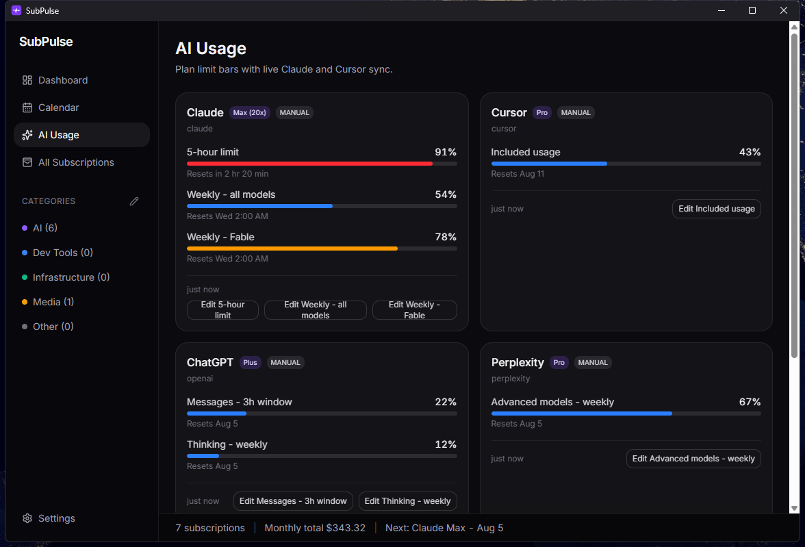
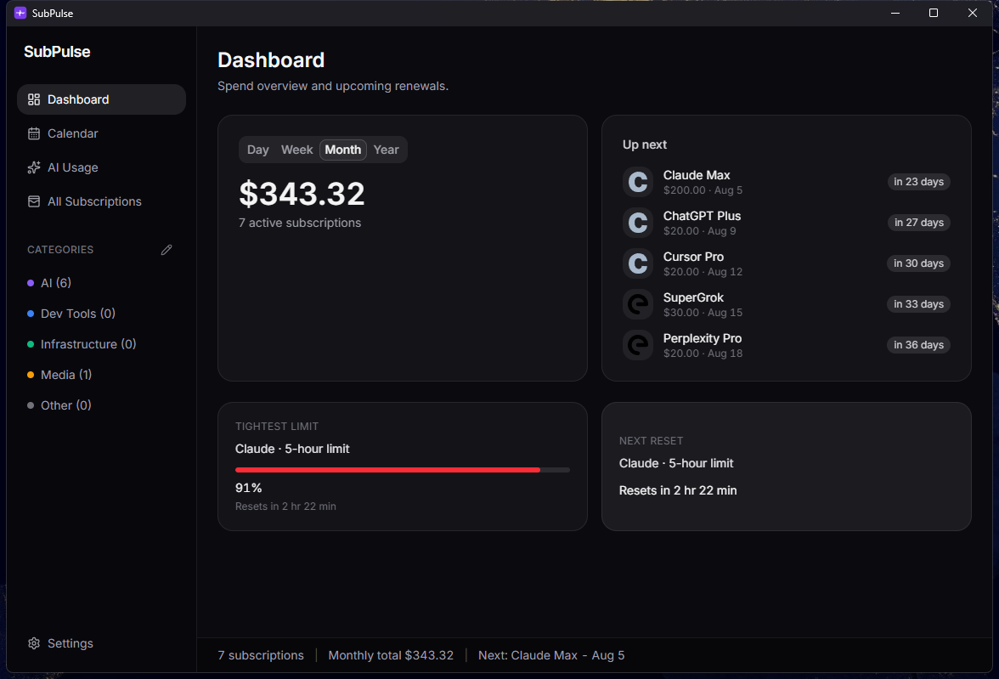

# SubPulse

**One Windows tray widget for two questions: what subscriptions are renewing, and how much of my AI plan limits have I burned?**

Local-first desktop app that tracks subscription renewals (like Apple's Subscriptions tab) and AI plan usage limits (like the Cursor/Claude usage panels) - with **live, zero-setup Claude Code limit bars** and **live Cursor usage** on Windows.



## Why

If you pay for Claude Max, Cursor, ChatGPT, Perplexity, and Gemini, you are spending hundreds of dollars a month across plans that each hide their renewal date and usage meters in a different settings page. SubPulse puts all of it in one always-on-top widget:

- **Live connectors** for Claude (5-hour / weekly / per-model weekly limits, read from your local Claude Code login - no pasting anything) and Cursor (included-usage pool, one cookie paste)
- **Manual cards with deep links** for plans that have no usage API (ChatGPT, Perplexity, Gemini, Grok) - two clicks to update, seeded with each plan's known limits
- **Subscription tracking**: renewals calendar, monthly/annual totals, category grouping, Windows toasts at T-3/T-1/T-0 days
- **Usage alerts**: a toast when a limit bucket crosses your threshold (default 85%), once per reset window
- **Tray + floating widget**: always-on-top mini panel with your next renewals and tightest limits



## Install

Download the installer from [Releases](https://github.com/jasonwall1387/subpulse/releases). It installs per-user (no admin prompt).

> **SmartScreen note:** the installer is not code-signed, so Windows will show
> "Windows protected your PC". Click **More info, then Run anyway**. If the
> project gets traction, code signing is on the roadmap.

Or build from source:

```bash
# prerequisites: Rust (MSVC), Node 22+, pnpm
pnpm install
pnpm tauri dev     # run in dev
pnpm tauri build   # build the NSIS installer
```

## How the live connectors work

**Claude (zero setup).** If Claude Code is installed and logged in, SubPulse reads the OAuth token it already keeps at `~/.claude/.credentials.json` (read-only, never written, never leaves your machine except to Anthropic itself) and calls the same usage endpoint Claude Code's own `/usage` panel uses. Your 5-hour, weekly, and per-model weekly percentages plus exact reset times appear with no configuration.

**Cursor (one cookie paste).** Paste your `WorkosCursorSessionToken` cookie from cursor.com/dashboard (DevTools, Application, Cookies) into Settings. It is stored in Windows Credential Manager - never in the database, never in a file. The card shows your included-usage pool percent and billing-cycle reset, matching the dashboard.

**Everything else is manual by design.** ChatGPT, Perplexity, Gemini, and Grok consumer plans have no personal usage APIs. Their cards are quick manual sliders with deep links to each provider's own usage page. No scraping, no headless browsers.

## Disclaimer

The Claude and Cursor connectors use **undocumented endpoints** that their
providers can change or remove at any time - the same approach used by tools
like ccusage, CodexBar, and cursor-stats. SubPulse polls them read-only, for
your own account, at a minimum 10-minute interval, and fails soft (a stale
badge, never a broken app) when they change. This project is not affiliated
with Anthropic, Cursor, OpenAI, Perplexity, Google, or xAI. Use at your own
risk under each provider's terms.

## Privacy

- No accounts, no telemetry, no cloud sync. Everything is local.
- Secrets (the Cursor cookie) live only in Windows Credential Manager.
- App state is a SQLite database in your local app-data directory.
- The Claude credentials file is read, never modified.

## Built with AI agents

This app went from idea to installed v0.1.0 in a single day: planned by Claude
(research-backed implementation plan in [docs/plan.md](docs/plan.md)), built
phase-by-phase by Cursor agents, with live gate verification between phases.
The commit history is the build log.

Stack: Tauri 2, React + TypeScript, Tailwind, SQLite. Rust surface is
intentionally tiny (Credential Manager access only).

## Roadmap

- Official API spend connectors (OpenAI, Anthropic admin, xAI, GitHub Copilot)
- macOS build (the codebase is already cross-platform)
- Usage history sparklines (snapshots are already being recorded)

## License

[MIT](LICENSE)
