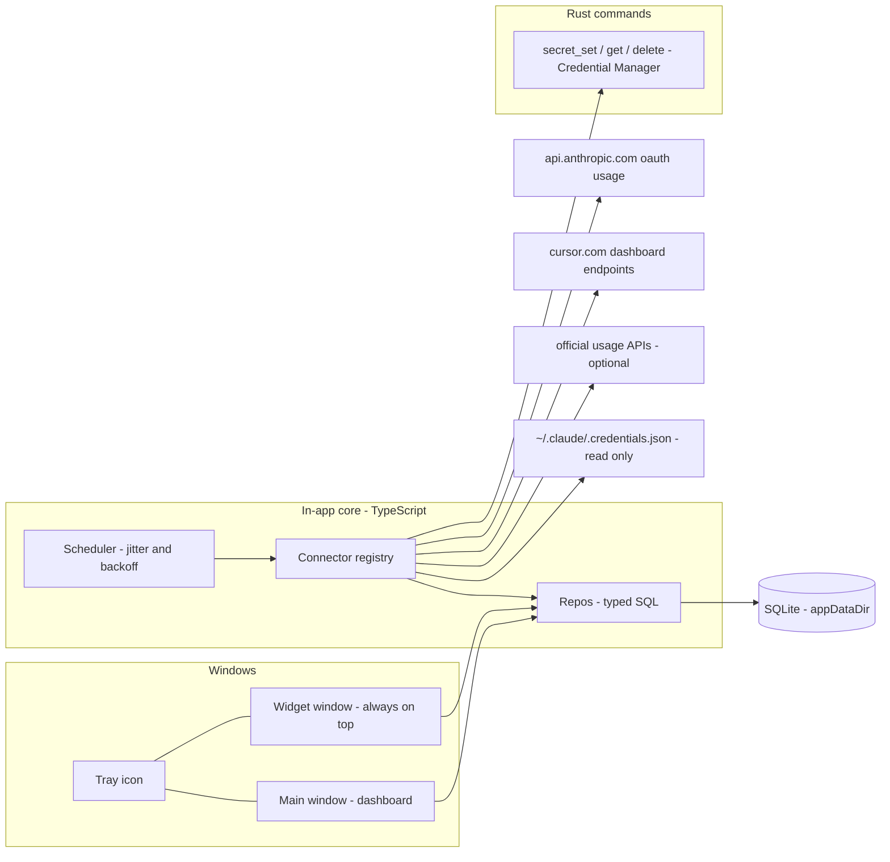

# SubPulse Implementation Plan - AI usage + subscriptions dashboard (Windows-first)

> **For agentic workers:** This plan is written to be executed by Cursor agents, one phase per agent session (see "Cursor prompt pack" near the end). If it is ever executed under Claude Code instead, use superpowers:subagent-driven-development or superpowers:executing-plans task-by-task. Steps use checkbox (`- [ ]`) syntax for tracking.

**Goal:** A local-first Windows desktop app (SubList-inspired) that tracks all subscriptions + renewals, and shows AI plan usage as Cursor/Claude-style limit bars (percent used + reset countdown), with live auto-sync where it is actually possible (Claude, Cursor) and frictionless manual entry everywhere else.

**Architecture:** Tauri 2 shell with two windows (main dashboard + frameless always-on-top widget), SQLite for all state, TypeScript connector framework polling providers on a jittered schedule, Rust used only for OS keychain secrets. Main window hides to tray instead of closing so the scheduler stays alive.

**Tech Stack:** Tauri 2.x, React 18 + TypeScript (strict) + Vite, Tailwind CSS v4 + shadcn/ui + lucide-react, TanStack Query v5, zod, date-fns, tauri-plugin-sql (SQLite), keyring crate (Windows Credential Manager).

**Author/date:** Planned by Claude (Fable 5) for Jason Wall, 2026-07-13. Research-backed; provider facts verified against sources listed in "Sources" (fetched 2026-07-13).

**Repo:** `C:\dev\subpulse` (new, private `jasonwall1387/subpulse`). Working name SubPulse; renaming later is a find-replace plus identifier change, do not bikeshed it now.

## Global Constraints

Every task's requirements implicitly include these:

- Windows 11 is the only v1 target. Do not add Mac/mobile conditionals; keep code portable by default (keyring + Tauri plugins are cross-platform already).
- Package manager: `pnpm`. Node 22 LTS. Rust stable (MSVC toolchain).
- TypeScript `strict: true`. No `any` at module boundaries.
- Every byte of external JSON (HTTP responses, credential files, CLI output) passes through a zod schema before use. Tolerant parsing: unknown extra fields must never throw.
- Secrets (cookies, API keys, tokens) live ONLY in Windows Credential Manager via the Rust keyring commands. Never in SQLite, never in git, never in logs, never in `connector_config` JSON.
- Unofficial connectors must fail soft: a connector error can never block the UI, other connectors, or subscriptions features. Stale data + status badge is the failure mode.
- Minimum refresh interval for unofficial endpoints: 10 minutes. Always send jittered, sequential (not parallel-burst) requests.
- Date math goes through `date-fns` helpers in `src/lib/` only; no raw `Date` arithmetic inside components. Renewal dates are date-only strings (`YYYY-MM-DD`), reset timestamps are ISO 8601 with timezone.
- Currency: store integer cents, display USD only in v1 (`Intl.NumberFormat('en-US', { style: 'currency', currency: 'USD' })`). Multi-currency conversion is out of scope.
- Identifier: `com.jasonwall.subpulse`. App data dir (SQLite db) is Tauri's `appDataDir()`.
- All docs/copy written for this repo: no em dashes (use " - "), never the word "straightforward".
- Conventional commits (`feat:`, `fix:`, `chore:`, `docs:`); commit at the end of every task; keep `STATUS.md` updated at the end of every phase.

---

## 0. Verdict: feasible, and how hard

Feasible. The build splits into three difficulty bands:

| Band | What | Difficulty |
|---|---|---|
| ~70% of the app | SubList-style subscription tracker, calendar, totals, dark glass UI, tray + always-on-top widget | Easy. Pure CRUD + UI assembly, no unknowns. Cursor agents excel at this. |
| ~20% | Live usage sync for Claude and Cursor | Medium. Both have proven, community-documented paths (see feasibility matrix), but they are unofficial and can drift. Built behind a fail-soft connector framework. |
| ~10% | Auto-sync for consumer chat plans (ChatGPT Plus, Perplexity Pro, Google AI Pro, Grok) | Not feasible without fragile scraping. These stay manual-with-deep-links by design. Chasing them is the scope-creep trap this plan explicitly walls off. |

Realistic effort with Cursor agents doing the typing: core v1 (Phases 0-3, everything usable with manual usage entry) is a weekend of part-time sessions. Live Claude + Cursor sync (Phase 4) is 1-2 more evenings. The original estimate of 1.5-2.5 weeks part-time for the full v1 is confirmed as realistic.

## 1. Context, users, success criteria

- Single user (Jason), single machine first (jwall-pc), personal data only. No accounts, no server, no telemetry.
- Two jobs: (1) "What is renewing and what do I pay per month?" like Apple's Subscriptions tab / SubList; (2) "How much of my AI plan limits have I burned and when do they reset?" like Claude Code's plan-usage popover and Cursor's usage page.
- Success criteria for v1:
  - App + widget survive a reboot (autostart, tray, positions remembered) and stay under ~150 MB RAM.
  - Adding a subscription takes under 30 seconds; renewal toasts arrive at T-3 and T-1 days.
  - Claude bucket percentages match Claude Code's own `/usage` panel within rounding, without Jason pasting anything (reads local Claude Code credentials).
  - Cursor usage matches the cursor.com dashboard after a one-time cookie paste.
  - Every other AI plan is a manual card that takes two clicks to update, with a deep link to that provider's own usage page.
- Evidence checked on this machine 2026-07-13: `C:\Users\jason\.claude\.credentials.json` exists, so the Claude local-credentials connector is viable here with zero setup.

## 2. Non-goals for v1

- No scraping of Apple/Google subscription stores, bank feeds, or email parsing to discover subscriptions. Manual entry + seed list only.
- No headless-browser scraping of consumer chat webapps (ChatGPT, Perplexity, Gemini, Grok). 2FA + bot defenses + TOS make it a maintenance treadmill; manual + deep link instead.
- No true Windows 11 "Widgets Board" widget (requires MSIX packaging + a COM Widget Provider). The widget is a frameless always-on-top Tauri window, which is what you actually want on a desktop anyway.
- No cloud sync, no iOS/Android app, no App Store distribution, no auto-update in v1.
- No multi-currency conversion, no shared/team features.
- Not a pixel-perfect SubList clone. Inspired layout and density; own assets and styling.

## 3. Assumptions and deferred decisions

Made autonomously (this plan was produced in a non-interactive session); all are cheap to change:

| Decision | Assumed value | Revisit when |
|---|---|---|
| App name / repo | `subpulse` at `C:\dev\subpulse` | Anytime; rename is cosmetic |
| Seed prices/tiers | Placeholders marked `EDIT ME` in `src/seed/seed.ts` (e.g. Claude Max 20x, Cursor Pro) | First run; edit in-app or in seed |
| Which official-API connectors to build | Phase 5 is optional; build only the ones whose keys Jason actually has | After Phase 4 ships |
| Time zone handling | System local (America/Chicago) for display; providers return UTC ISO timestamps | Only if machine TZ changes |
| Mac build | Same repo, built on the MacBook later; no work in v1 beyond staying cross-platform | After v1 is in daily use |
| iPhone | Deferred entirely; realistic path is a later sync layer + small native/PWA client, sketched in "Future" section | Day 30+, only if desktop v1 sticks |

## 4. Alternatives considered

- **A. Tauri 2 desktop app (chosen).** Small binaries and RAM footprint, real tray + multi-window + always-on-top, Rust keyring access, one codebase that later builds on macOS. Cost: Rust toolchain prerequisite on the build machine.
- **B. Electron.** Same UI stack, more familiar tooling, but 3-5x the memory for a widget that sits open all day, and no advantage for this app.
- **C. Self-hosted web app (e.g. on the NAS) or Wallos.** Wallos is a solid self-hosted subscription tracker, and a web app would be phone-accessible on day one. Rejected for v1 because both killer features are desktop-local: the always-on-top widget, and reading Claude Code's local credentials/logs on this PC. A web deployment cannot see either without installing an agent on the PC anyway.
- **D. Buy instead of build.** SubList is Apple-only. Wallos does subscriptions but no AI usage. cursor-stats, ccusage and the various Claude monitors each cover one provider with no subscription tracking. Nothing unifies both jobs on Windows, so building is justified (and the point).

Recommendation: A, which the v0 plan had already picked. Validated rather than changed.

## 5. Evaluation of the v0 plan (what changed and why)

The v0 draft was directionally right: stack, hybrid manual+API approach, phasing, non-goals, and the 1.5-2.5 week estimate all survive. Fixes applied in this plan:

1. **Location.** `~/Projects/subpulse` does not exist on this machine and violates workspace conventions. Corrected to `C:\dev\subpulse` (Windows dev root; flat `~/dev/subpulse` on the Mac later).
2. **The Claude connector was mis-modeled.** v0 lumped Anthropic under "official API usage" (Phase 3). The Admin usage API measures API-org spend, not the Max plan's 5-hour/weekly buckets. The thing Jason actually wants (the popover in his screenshot) comes from Claude Code's own local OAuth credentials + the usage endpoint the app itself uses, plus a local-log fallback. That is now the flagship Phase 4 connector, with exact endpoints from research.
3. **Cursor promoted from "Phase 4 stretch" to core Phase 4.** It is the daily driver, and the community pattern (cursor-stats et al.) is well-trodden. Claude + Cursor together ARE the AI-usage feature; official platform APIs are the stretch, not the other way round.
4. **Same correction on OpenAI:** org Usage/Costs API does not see ChatGPT Plus. Consumer plans are explicitly manual-with-deep-links, each seeded with current known limits so manual cards are useful from minute one.
5. **Added everything a builder-ready plan needs that v0 lacked:** exact schema DDL, connector interface with normalization + fail-soft policy, security scopes (Tauri capabilities, keyring), notification dedupe, tested date/money edge cases (month-end clamp, reset roll-forward), phase gates, seed data, repo hygiene files (AGENTS.md/CLAUDE.md/STATUS.md per workspace convention), and a Cursor prompt pack.
6. **Widget honesty.** "Windows widget" = always-on-top frameless window + tray, stated as such; Widgets Board is a non-goal.
7. **Mobile honesty.** Tauri 2 ships iOS apps but not iOS home-screen widgets; the phone story is deferred and sketched separately instead of implied.

## 6. Provider feasibility matrix (researched 2026-07-13)

Legend: **auto** = connector in this plan; **manual** = manual card + deep link. Confidence reflects source quality at research time.

| Plan | Sync | Mechanism | Confidence / fragility |
|---|---|---|---|
| Claude Pro/Max (his Max 20x) | **auto, Phase 4, zero setup** | Read `%USERPROFILE%\.claude\.credentials.json` -> `GET api.anthropic.com/api/oauth/usage` (the endpoint Claude Code's own `/usage` panel uses). Returns 5-hour, weekly, per-model weekly buckets with `utilization` + `resets_at`. | High confidence (documented across a dozen OSS monitors). Unofficial: medium fragility, tolerant parser + fallbacks specified |
| Cursor Pro | **auto, Phase 4, one cookie paste** | `GET cursor.com/api/usage-summary` with `WorkosCursorSessionToken` cookie + browser-mimic headers. Returns included-usage pool (cents) + on-demand spend + billing cycle dates. | High confidence today; historically the most churn-prone surface (pricing changed repeatedly; the old cursor-stats extension died of it). Fail-soft + fixtures |
| ChatGPT Plus | manual | No personal usage API. Card seeded ~160 msgs / rolling 3h (default model) + Thinking 3000/wk; deep link to `chatgpt.com/codex/settings/usage` (Codex meter is the only real gauge OpenAI shows) | Med confidence on numbers, volatile |
| Perplexity Pro | manual | No API; "unlimited" soft caps, advanced-model queries quietly reduced May 2026 (~100-150/wk reported). Deep link `perplexity.ai/account/usage`. The old $5/mo API credit was discontinued ~Feb 2026 | Low-med confidence, volatile |
| Google AI Pro (Gemini) | manual | No API. Official structure: allowance refreshes every 5 hours under a weekly cap (numbers unpublished, "4x free tier"). Card gets a percent-only 5h bucket + weekly bucket; usage panel is inside the Gemini app settings | High on structure, low on numbers |
| SuperGrok / X Premium+ | manual | Nothing published, third-party estimates conflict (rolling ~2-4h chat windows). Card = one "session limit" bucket used as a hit-the-wall logger | Low confidence by design |
| GitHub Copilot Pro/Pro+ | auto possible, Phase 5 | Official REST billing usage API for individuals (classic PAT): AI Credits ($10/$39 monthly pools since 2026-06-01) or legacy 300/1500 premium requests on annual plans | High confidence, official |
| OpenAI API (platform) | auto possible, Phase 5 | Official org Costs/Usage API, admin key self-mintable on solo accounts | High, official |
| Anthropic API (RWAI org) | auto possible, Phase 5 | Official Admin usage/cost API; requires org (not individual accounts). Measures API spend, NOT the Max plan | High, official |
| xAI API | auto possible, Phase 5 | Official Management API `POST /v1/billing/teams/{id}/usage` + prepaid balance; every account has a default personal team | High, official |
| Gemini API | none | Only route is GCP Cloud Monitoring (project + service account + metric queries) - not worth it for a personal dashboard | Documented dead end |

## 7. Architecture



Process model decisions (normative):

- **One long-lived webview owns all background work.** The main window never closes; the window close button hides it to tray (`onCloseRequested -> preventDefault + hide`). Its JS context runs the scheduler, so no Rust cron is needed. Quit happens only via tray menu.
- **Widget is a second Tauri window** (label `widget`) loading the same bundle at hash route `#/widget`. It only reads the DB and listens for `usage:updated` / `subs:updated` events; it never fetches.
- **Rust surface is intentionally tiny:** three keyring commands. Everything else is plugins + TS. This keeps the codebase in Cursor's sweet spot.
- **Events:** after any successful connector run or CRUD mutation, emit `usage:updated` / `subs:updated` app-wide; React Query invalidates on these. Widget and main window stay in sync for free.
- **Scheduler policy:** per enabled plan, interval = `refresh_minutes` with +/-10% jitter; on failure exponential backoff (x2 up to 60 min) and `last_status='error'`; on auth failure `last_status='auth'` and NO retry until the user acts (prevents hammering a dead cookie). Manual "Refresh" buttons bypass backoff. Refresh-all runs connectors sequentially, not in parallel.
- **Staleness rule:** a plan whose `last_fetch_at` is older than 2x its interval renders a "stale" badge; data is never hidden just because it is old.

Security model:

- Keyring service name `subpulse`; entry names like `cursor_cookie_default`, `openai_admin_key`. `connector_config` stores only `{"secretRef":"cursor_cookie_default"}`.
- `tauri-plugin-http` capability scoped to an explicit URL allowlist (exact domains used by shipped connectors only). `tauri-plugin-fs` scoped read-only to `$HOME/.claude/**`. No other FS access from the frontend.
- The Claude credentials file is read, never written, and its contents never leave the machine except as the Authorization header to Anthropic itself.
- Renewal/usage data is personal-finance-ish: DB stays in `appDataDir`, `.gitignore` excludes `*.db`, and CSV export is user-initiated only.
- Unofficial endpoints (Cursor, Claude oauth usage): personal-use, read-only, low-frequency polling of Jason's own accounts. Documented as TOS-gray; acceptable personal risk, never shipped to third parties.

## 8. Data model (SQLite, exact DDL)

Two migrations. Migration 1 ships in Phase 1, migration 2 in Phase 2. Registered in Rust via `tauri_plugin_sql::Builder::default().add_migrations("sqlite:subpulse.db", vec![...])`.

```sql
-- Migration 1: subscriptions core
CREATE TABLE categories (
  id INTEGER PRIMARY KEY AUTOINCREMENT,
  name TEXT NOT NULL UNIQUE,
  color TEXT NOT NULL DEFAULT '#8b5cf6',
  emoji TEXT,
  sort_order INTEGER NOT NULL DEFAULT 0
);

CREATE TABLE subscriptions (
  id INTEGER PRIMARY KEY AUTOINCREMENT,
  name TEXT NOT NULL,
  category_id INTEGER REFERENCES categories(id) ON DELETE SET NULL,
  price_cents INTEGER NOT NULL DEFAULT 0,
  currency TEXT NOT NULL DEFAULT 'USD',
  billing_cycle TEXT NOT NULL DEFAULT 'monthly'
    CHECK (billing_cycle IN ('weekly','monthly','quarterly','annual','custom')),
  cycle_days INTEGER,
  next_renewal TEXT,
  auto_renews INTEGER NOT NULL DEFAULT 1,
  payment_method TEXT,
  url TEXT,
  notes TEXT,
  is_trial INTEGER NOT NULL DEFAULT 0,
  trial_ends TEXT,
  status TEXT NOT NULL DEFAULT 'active' CHECK (status IN ('active','paused','canceled')),
  icon_kind TEXT NOT NULL DEFAULT 'auto' CHECK (icon_kind IN ('auto','simple','emoji')),
  icon_value TEXT,
  created_at TEXT NOT NULL DEFAULT (datetime('now')),
  updated_at TEXT NOT NULL DEFAULT (datetime('now'))
);

CREATE TABLE app_settings (key TEXT PRIMARY KEY, value TEXT NOT NULL);

CREATE TABLE notified_renewals (
  subscription_id INTEGER NOT NULL REFERENCES subscriptions(id) ON DELETE CASCADE,
  renewal_date TEXT NOT NULL,
  kind TEXT NOT NULL CHECK (kind IN ('t3','t1','t0')),
  notified_at TEXT NOT NULL DEFAULT (datetime('now')),
  PRIMARY KEY (subscription_id, renewal_date, kind)
);
```

```sql
-- Migration 2: AI usage
CREATE TABLE usage_plans (
  id INTEGER PRIMARY KEY AUTOINCREMENT,
  subscription_id INTEGER REFERENCES subscriptions(id) ON DELETE SET NULL,
  provider TEXT NOT NULL,
  display_name TEXT NOT NULL,
  tier_label TEXT,
  connector TEXT NOT NULL DEFAULT 'manual',
  connector_config TEXT NOT NULL DEFAULT '{}',
  enabled INTEGER NOT NULL DEFAULT 1,
  refresh_minutes INTEGER NOT NULL DEFAULT 15,
  last_fetch_at TEXT,
  last_status TEXT NOT NULL DEFAULT 'never' CHECK (last_status IN ('never','ok','error','auth')),
  last_error TEXT,
  sort_order INTEGER NOT NULL DEFAULT 0
);

CREATE TABLE limit_buckets (
  id INTEGER PRIMARY KEY AUTOINCREMENT,
  plan_id INTEGER NOT NULL REFERENCES usage_plans(id) ON DELETE CASCADE,
  key TEXT NOT NULL,
  label TEXT NOT NULL,
  window_kind TEXT NOT NULL DEFAULT 'custom'
    CHECK (window_kind IN ('rolling_5h','daily','weekly','monthly','plan_period','custom')),
  used REAL,
  limit_value REAL,
  unit TEXT CHECK (unit IN ('requests','tokens','usd','percent')),
  percent REAL NOT NULL DEFAULT 0,
  resets_at TEXT,
  reset_behavior TEXT NOT NULL DEFAULT 'zero' CHECK (reset_behavior IN ('zero','hold')),
  source TEXT NOT NULL DEFAULT 'manual' CHECK (source IN ('manual','api','unofficial','local')),
  alerted_for_reset TEXT,
  updated_at TEXT NOT NULL DEFAULT (datetime('now')),
  UNIQUE (plan_id, key)
);

CREATE TABLE usage_snapshots (
  id INTEGER PRIMARY KEY AUTOINCREMENT,
  plan_id INTEGER NOT NULL,
  bucket_key TEXT NOT NULL,
  percent REAL NOT NULL,
  used REAL,
  limit_value REAL,
  captured_at TEXT NOT NULL DEFAULT (datetime('now'))
);
CREATE INDEX idx_snapshots_plan ON usage_snapshots(plan_id, bucket_key, captured_at);
```

Notes:

- `limit_value` because `limit` is an SQL keyword.
- `limit_buckets` is current-state (upserted on `(plan_id, key)`); `usage_snapshots` is append-only history for future sparklines. Snapshot every successful fetch and every manual edit.
- `alerted_for_reset` stores the `resets_at` value an 85% alert was sent for, so each window alerts at most once.
- Renewal `kind` values: `t3` = 3 days out, `t1` = 1 day out, `t0` = renewal day.

## 9. Connector framework (normative interfaces)

```ts
// src/lib/connectors/types.ts
export type WindowKind = 'rolling_5h' | 'daily' | 'weekly' | 'monthly' | 'plan_period' | 'custom';
export type BucketSource = 'manual' | 'api' | 'unofficial' | 'local';
export type BucketUnit = 'requests' | 'tokens' | 'usd' | 'percent';

export interface NormalizedBucket {
  key: string;                 // stable per plan, e.g. 'five_hour'
  label: string;               // '5-hour limit'
  windowKind: WindowKind;
  percent: number;             // 0..100, always present after normalization
  used?: number;
  limit?: number;
  unit?: BucketUnit;
  resetsAt?: string;           // ISO 8601
  source: BucketSource;
}

export interface FetchResult {
  buckets: NormalizedBucket[];
  tierLabel?: string;          // e.g. 'Max (20x)' when the provider reports it
  fetchedAt: string;           // ISO 8601
}

export interface SetupField {
  key: string;                 // 'cookie'
  label: string;               // 'WorkosCursorSessionToken cookie'
  secret: boolean;             // true -> stored via keyring, shown masked
  help: string;                // one-paragraph how-to shown in the setup dialog
}

export type ConnectorErrorKind = 'auth' | 'network' | 'parse' | 'other';
export class ConnectorError extends Error {
  constructor(message: string, public kind: ConnectorErrorKind) { super(message); }
}

export interface ConnectorContext {
  config: Record<string, unknown>;          // parsed connector_config (non-secret)
  getSecret(ref: string): Promise<string | null>;  // keyring lookup
  fetch: typeof fetch;                       // tauri http plugin fetch
}

export interface Connector {
  id: string;                  // matches usage_plans.connector
  displayName: string;
  setupFields: SetupField[];   // empty for zero-config connectors
  probe(ctx: ConnectorContext): Promise<{ ok: boolean; message: string }>;
  fetchUsage(ctx: ConnectorContext): Promise<FetchResult>;  // throws ConnectorError
}
```

Normalization rules (implemented once in `src/lib/connectors/normalize.ts`, unit-tested):

- If `percent` missing but `used`+`limit` present: `percent = used / limit * 100`.
- Clamp percent to `[0, 100]`; round to one decimal for storage, whole number for display.
- A bucket with neither percent nor used+limit is dropped with a logged warning (never throws the whole fetch away).
- Unknown provider bucket keys are still rendered: humanize the key for the label (`seven_day_fable` -> `Weekly - Fable`). This future-proofs against Anthropic renaming model buckets.
- Reset roll-forward for manual buckets (`advanceBucketOnReset`): when `resets_at < now`, advance it by its window (`rolling_5h` +5h, `daily` +1d, `weekly` +7d, `monthly` +1 month clamped) until it is in the future; set `percent`/`used` to 0 when `reset_behavior='zero'`, keep when `'hold'`. `plan_period`/`custom` never auto-advance.

Fail-soft policy (normative): `runPlan(planId)` wraps `fetchUsage` in try/catch; on success upsert buckets + insert snapshots + `last_status='ok'`; on `ConnectorError('auth')` set `last_status='auth'`, keep old buckets, suspend scheduling until user re-auths; on any other error set `last_status='error'`, keep old buckets, back off. The subscriptions side of the app has zero imports from `src/lib/connectors/`.

## 10. UI spec

Design language (crib the SubList screenshot's mood, own execution):

- Window bg `#0a0a0f`; content cards `bg-white/[0.04] border border-white/[0.08] rounded-2xl backdrop-blur-xl`; hover `bg-white/[0.07]`.
- Text: `text-zinc-100` primary, `text-zinc-400` secondary, `tabular-nums` for all numbers; font Inter (bundled via `@fontsource-variable/inter`, no network fetch).
- Category accent dots + card tints from `categories.color`; AI category default violet `#8b5cf6`.
- Progress bars: 6px tall, `rounded-full`, track `bg-white/10`; fill `bg-blue-500` under 75%, `bg-amber-500` 75-89.9%, `bg-red-500` at 90%+. Percent label right-aligned.
- Reset copy (exact formats, implemented in `formatReset`): under 1h `Resets in 42 min`; under 24h `Resets in 3 hr 58 min`; under 7d `Resets Wed 1:59 AM`; else `Resets Jul 22`.
- Money: always cents-accurate, `$108.20` style; period toggle labels `Day / Week / Month / Year`.

Main window (1160x760 default, 980x640 min, dark only):

- **Sidebar:** Dashboard, Calendar, AI Usage, All Subscriptions, then category list with counts (`AI (8)`), then Settings pinned bottom. Active item = white/10 pill.
- **Footer bar (persistent):** `N subscriptions | Monthly total $X | Next: <name> - <date>` mirroring SubList's footer.
- **DashboardView:** hero card (period toggle + total for period + active count), "Up next" list (next 5 renewals: icon, name, price, `in 4 days` chip), "Tightest limit" tile (worst usage bucket across enabled plans: plan name, bucket label, bar, reset copy) + "Next reset" tile. Tiles click through to AI Usage.
- **SubscriptionsView:** card grid (2-3 cols), grouped by category with headers; card = icon, name, `$20.00 /mo` (+ `$240.00 /yr` equivalent subtext), next-due date, trial badge when `is_trial`, status dim when paused/canceled; search box; filter chips (Active / Trials / Paused+Canceled / All); "Add subscription" button (Ctrl+N).
- **SubscriptionDialog (add/edit):** name, category select (+ inline create), price, cycle select (weekly/monthly/quarterly/annual/custom days), next renewal date picker, auto-renews toggle, payment method text, URL, notes, trial toggle + end date, icon picker (auto = match simple-icons slug from name, else emoji). Delete + archive (paused) actions in edit mode.
- **CalendarView:** month grid; day cells show up to 2 renewal chips + `+n` overflow; click day = popover listing that day's renewals; header shows month nav + `$ due this month`.
- **UsageView:** grid of PlanCards. PlanCard = provider icon + display name + tier chip (`Max (20x)`), source badge (`auto` blue / `manual` zinc / `stale` amber / `auth needed` red), bucket rows (BucketRow = label, bar, percent, reset copy), footer row: last-updated relative time, refresh button (auto plans), edit button (manual plans -> ManualUpdatePopover: percent slider + quick chips 0/25/50/75/100 + reset datetime picker), external-link icon when `usagePageUrl` configured.
- **SettingsView:** General (launch at login, start hidden, close-to-tray), Widget (show widget, always on top, opacity 60-100%), Notifications (renewal T-3/T-1/T-0 toggles, usage alert threshold default 85%, per-plan alert toggle), Connections (per plan: connector picker, SetupField inputs -> keyring, Test button running `probe`, refresh interval, last status + error string), Data (load seed, export CSV, open data folder, reset database with confirm).

Widget window (300x392 default, frameless, transparent, always-on-top per setting, skip-taskbar, no resize):

- Header (drag region via `data-tauri-drag-region`): colored dot + "SubPulse", refresh icon, pin icon (toggles always-on-top), close icon (hides widget).
- Section "Up next": top 3 renewals (name, `$20`, `in 4d`).
- Section "AI usage": top 3 buckets across enabled plans sorted by percent desc (plan short name + bucket label, bar, percent, short reset copy).
- Right-click anywhere: in-app context menu (Open SubPulse / Refresh all / Hide widget / Quit).
- Position persisted by `tauri-plugin-window-state`.

Tray:

- Left click: show/focus main window (restore if hidden).
- Tooltip: `SubPulse - <worst bucket short> | next: <name> <date>`, refreshed after every data update.
- Menu: Open SubPulse, Refresh all, Show widget (checkable), Launch at login (checkable), Quit.

## 11. File structure (lock-in for all tasks)

```
subpulse/
  AGENTS.md                    # thin map per workspace convention
  CLAUDE.md                    # "@AGENTS.md"
  STATUS.md                    # session hygiene, updated end of each phase
  README.md
  .gitignore                   # node_modules, dist, src-tauri/target, *.db, .env*
  .cursor/rules/subpulse.mdc   # Cursor guardrails (content in Task 0.5)
  docs/plan.md                 # this file, copied in at Task 0.5
  package.json  pnpm-lock.yaml  vite.config.ts  tsconfig.json  vitest.config.ts
  index.html
  src/
    main.tsx                   # router: window label 'widget' -> WidgetView, else App shell
    App.tsx
    styles.css                 # tailwind entry + tokens
    lib/
      db.ts                    # Database.load singleton, exec/select helpers
      events.ts                # emit/listen wrappers for 'usage:updated' | 'subs:updated'
      money.ts   cycles.ts   resets.ts   format.ts   icons.ts
      secrets.ts               # invoke('secret_get'|'secret_set'|'secret_delete')
      repo/
        subscriptions.ts  categories.ts  usage.ts  settings.ts
      connectors/
        types.ts  normalize.ts  registry.ts  scheduler.ts
        claudeLocal.ts  cursorCookie.ts
        anthropicAdmin.ts  openaiAdmin.ts  githubBilling.ts  xaiManagement.ts   # phase 5, optional
      notify/
        renewals.ts  usageAlerts.ts
    components/
      shell/Sidebar.tsx  shell/FooterBar.tsx
      subscriptions/SubscriptionCard.tsx  subscriptions/SubscriptionDialog.tsx  subscriptions/CategoryManager.tsx
      usage/PlanCard.tsx  usage/BucketRow.tsx  usage/ManualUpdatePopover.tsx  usage/ConnectorSettings.tsx
      dashboard/HeroTotals.tsx  dashboard/UpcomingList.tsx  dashboard/UsageTiles.tsx
      calendar/CalendarMonth.tsx
    views/
      DashboardView.tsx  SubscriptionsView.tsx  CalendarView.tsx  UsageView.tsx  SettingsView.tsx  WidgetView.tsx
    seed/seed.ts
    __tests__/                 # vitest: money, cycles, resets, normalize, claudeParse, cursorParse
  src-tauri/
    tauri.conf.json
    capabilities/default.json  capabilities/widget.json
    src/main.rs  src/lib.rs  src/secrets.rs
    icons/
```

## 12. Phases and tasks

Execution rules: one phase per Cursor agent session. Within a phase, tasks run in order. Every task ends with `pnpm check` (typecheck + tests) green and a commit. A phase is done only when its gate checklist passes. TDD applies to all pure logic (`src/lib/**`): write the test first, watch it fail, implement, watch it pass.

`package.json` scripts (created in Task 0.3, used everywhere):

```json
{
  "scripts": {
    "dev": "tauri dev",
    "build": "tauri build",
    "check": "tsc --noEmit && vitest run",
    "test": "vitest"
  }
}
```

---

### Phase 0 - Scaffold and repo hygiene

#### Task 0.1: Prerequisites (human, one-time)

Jason runs these once; Cursor agents verify and stop with a clear message if missing.

- [ ] Install Rust (MSVC): `winget install Rustlang.Rustup` then `rustup default stable-msvc`
- [ ] Install VS Build Tools C++ workload: `winget install Microsoft.VisualStudio.2022.BuildTools --override "--wait --add Microsoft.VisualStudio.Workload.VCTools --includeRecommended"`
- [ ] Node 22 + pnpm available: `node -v` (v22.x), `corepack enable && pnpm -v`
- [ ] Verify: `rustc -V` and `cargo -V` both print versions. WebView2 ships with Windows 11; no action.

#### Task 0.2: Scaffold Tauri app

**Files:** Create: entire repo at `C:\dev\subpulse` via scaffold; Modify: `src-tauri/tauri.conf.json`

- [ ] **Step 1:** `cd C:\dev && pnpm create tauri-app@latest subpulse` - answers: identifier `com.jasonwall.subpulse`, frontend `React`, language `TypeScript`, bundler `Vite`, package manager `pnpm`.
- [ ] **Step 2:** `cd subpulse && pnpm install && git init && git add -A && git commit -m "chore: scaffold tauri 2 react-ts app"`
- [ ] **Step 3:** Edit `src-tauri/tauri.conf.json`: `productName: "SubPulse"`, main window entry in `app.windows`:

```json
{
  "label": "main",
  "title": "SubPulse",
  "width": 1160, "height": 760,
  "minWidth": 980, "minHeight": 640,
  "center": true
}
```

- [ ] **Step 4:** Run `pnpm tauri dev`; expected: a window titled SubPulse opens with the Vite template. First Rust compile takes several minutes; that is normal.
- [ ] **Step 5:** Commit: `git commit -am "chore: app identity and main window config"`

#### Task 0.3: Frontend toolchain

**Files:** Modify: `vite.config.ts`, `package.json`, `index.html`; Create: `src/styles.css`, `vitest.config.ts`, `tsconfig.json` (strict), `components.json` (shadcn)

- [ ] **Step 1:** `pnpm add tailwindcss @tailwindcss/vite @tanstack/react-query zod date-fns react-router-dom lucide-react @fontsource-variable/inter simple-icons && pnpm add -D vitest`
- [ ] **Step 2:** Wire Tailwind v4: add `tailwindcss()` to `vite.config.ts` plugins; `src/styles.css` starts with `@import "tailwindcss";` plus the design tokens from section 10 as CSS variables (`--bg: #0a0a0f;` etc.); import it in `src/main.tsx`.
- [ ] **Step 3:** Init shadcn/ui (`pnpm dlx shadcn@latest init`, style default, base color zinc, CSS variables yes) and add primitives used later: `pnpm dlx shadcn@latest add button dialog dropdown-menu input label popover select switch tabs tooltip`
- [ ] **Step 4:** Ensure `tsconfig.json` has `"strict": true`. Create `vitest.config.ts` (node env, include `src/**/__tests__/**/*.test.ts`). Add the `check` script from the phase preamble.
- [ ] **Step 5:** Sanity test `src/__tests__/smoke.test.ts`: `expect(1 + 1).toBe(2)`. Run `pnpm check`; expected PASS. Commit `chore: ui toolchain (tailwind4, shadcn, query, zod, vitest)`.

#### Task 0.4: Tauri plugins, capabilities, Rust keyring commands

**Files:** Modify: `src-tauri/Cargo.toml`, `src-tauri/src/lib.rs`, `src-tauri/tauri.conf.json`, `package.json`; Create: `src-tauri/src/secrets.rs`, `src-tauri/capabilities/default.json`, `src-tauri/capabilities/widget.json`

**Interfaces - Produces:** Tauri commands `secret_set(serviceKey, value)`, `secret_get(serviceKey) -> string | null`, `secret_delete(serviceKey)` (JS camelCase maps to Rust snake_case automatically).

- [ ] **Step 1:** Add plugins. JS: `pnpm add @tauri-apps/plugin-sql @tauri-apps/plugin-http @tauri-apps/plugin-fs @tauri-apps/plugin-notification @tauri-apps/plugin-autostart @tauri-apps/plugin-window-state @tauri-apps/plugin-log @tauri-apps/plugin-opener @tauri-apps/plugin-dialog @tauri-apps/plugin-process`. Rust (`src-tauri`): `cargo add tauri-plugin-sql --features sqlite`, `cargo add tauri-plugin-http tauri-plugin-fs tauri-plugin-notification tauri-plugin-autostart tauri-plugin-window-state tauri-plugin-log tauri-plugin-opener tauri-plugin-dialog tauri-plugin-process tauri-plugin-single-instance`, `cargo add keyring`. Verified 2026-07-13: all these plugins exist for Tauri 2 under exactly these names (sql 2.4, http 2.5, fs 2.5, notification 2.3, autostart 2.5, window-state 2.4, log 2.8, opener 2.5, dialog 2.7); `single-instance` is Rust-only (no npm package, register it FIRST); `keyring` v4 defaults already include the Windows Credential Manager backend (no feature flag). Do NOT use tauri-plugin-stronghold (maintainer-flagged for deprecation) or plugin-store for secrets (plaintext JSON). Keyring calls are blocking; acceptable at this call volume.
- [ ] **Step 2:** Create `src-tauri/src/secrets.rs`:

```rust
use keyring::Entry;

const SERVICE: &str = "subpulse";

#[tauri::command]
pub fn secret_set(service_key: String, value: String) -> Result<(), String> {
    Entry::new(SERVICE, &service_key)
        .and_then(|e| e.set_password(&value))
        .map_err(|e| e.to_string())
}

#[tauri::command]
pub fn secret_get(service_key: String) -> Result<Option<String>, String> {
    match Entry::new(SERVICE, &service_key).and_then(|e| e.get_password()) {
        Ok(v) => Ok(Some(v)),
        Err(keyring::Error::NoEntry) => Ok(None),
        Err(e) => Err(e.to_string()),
    }
}

#[tauri::command]
pub fn secret_delete(service_key: String) -> Result<(), String> {
    match Entry::new(SERVICE, &service_key).and_then(|e| e.delete_credential()) {
        Ok(()) => Ok(()),
        Err(keyring::Error::NoEntry) => Ok(()),
        Err(e) => Err(e.to_string()),
    }
}
```

- [ ] **Step 3:** Register everything in `src-tauri/src/lib.rs`: all `.plugin(...)` builders, `tauri_plugin_single_instance::init(|app, _, _| { /* focus main window */ })` FIRST, migrations placeholder for sql plugin (filled in Task 1.1), and `.invoke_handler(tauri::generate_handler![secrets::secret_set, secrets::secret_get, secrets::secret_delete])`.
- [ ] **Step 4:** Write `src-tauri/capabilities/default.json` scoped to windows `["main", "widget"]`:

```json
{
  "identifier": "default",
  "windows": ["main", "widget"],
  "permissions": [
    "core:default",
    "core:window:allow-hide", "core:window:allow-show", "core:window:allow-set-focus",
    "core:window:allow-set-always-on-top", "core:window:allow-start-dragging",
    "core:event:default", "core:tray:default", "core:menu:default", "core:image:default",
    "sql:default", "sql:allow-execute", "sql:allow-select", "sql:allow-load",
    "notification:default", "autostart:default", "window-state:default",
    "log:default", "dialog:default", "process:allow-exit", "process:allow-restart",
    { "identifier": "opener:allow-open-url", "allow": [{ "url": "https://**" }] },
    { "identifier": "fs:allow-read-text-file", "allow": [{ "path": "$HOME/.claude/.credentials.json" }] },
    { "identifier": "fs:allow-exists", "allow": [{ "path": "$HOME/.claude/.credentials.json" }] },
    {
      "identifier": "http:default",
      "allow": [
        { "url": "https://api.anthropic.com/api/oauth/usage" },
        { "url": "https://cursor.com/**" },
        { "url": "https://api.openai.com/v1/organization/**" },
        { "url": "https://api.github.com/users/**" },
        { "url": "https://management-api.x.ai/**" }
      ]
    }
  ]
}
```

(Exact permission identifier strings sometimes shift between plugin minor versions; if `pnpm tauri dev` errors on an identifier, fix the name per the error message, do not widen scopes.)

- [ ] **Step 5:** Smoke test from devtools console: `await window.__TAURI__.core.invoke('secret_set', { serviceKey: 'smoke', value: 'ok' })` then `secret_get` returns `'ok'`, then `secret_delete`. Verify the entry appeared under Windows Credential Manager while set. Commit `feat: plugins, capabilities, keyring secret commands`.

#### Task 0.5: Repo hygiene files

**Files:** Create: `AGENTS.md`, `CLAUDE.md`, `STATUS.md`, `README.md`, `.gitignore`, `.cursor/rules/subpulse.mdc`, `docs/plan.md`

- [ ] **Step 1:** `CLAUDE.md` contains exactly `@AGENTS.md`. `.gitignore`: `node_modules/`, `dist/`, `src-tauri/target/`, `*.db`, `*.db-journal`, `.env*`, `*.local.json` exceptions as needed.
- [ ] **Step 2:** `AGENTS.md` (keep under 80 lines):

```markdown
# subpulse - AI usage + subscriptions desktop dashboard (personal)

Windows-first Tauri 2 app: SubList-style subscription/renewal tracking plus
Cursor/Claude-style AI plan usage bars. Local-first, no accounts, no telemetry.

## Stack
Tauri 2 + React 18 + TS strict + Vite | Tailwind v4 + shadcn/ui | SQLite
(tauri-plugin-sql) | TanStack Query + zod + date-fns | Rust: keyring only.

## Commands
- `pnpm tauri dev` - run app
- `pnpm check` - typecheck + vitest (must pass before every commit)
- `pnpm tauri build` - NSIS installer

## Hard rules
- Secrets ONLY in Windows Credential Manager via secret_* commands. Never in
  SQLite, git, logs, or connector_config.
- External JSON (HTTP, credential file) always through zod, tolerant of
  unknown fields.
- Unofficial connectors (claude_local, cursor_cookie) fail soft: stale badge,
  never block UI. Min poll 10 min.
- ~/.claude/.credentials.json is READ ONLY. Never write, never log its contents.
- Date math only in src/lib (date-fns). Money is integer cents, USD display.
- Docs style: no em dashes (use " - "), never the word "straightforward".

## Map
- Plan: docs/plan.md (source of truth for tasks/gates)
- Session status: STATUS.md (update at end of every phase)
```

- [ ] **Step 3:** `.cursor/rules/subpulse.mdc` frontmatter `alwaysApply: true`, body: the Hard rules block from AGENTS.md plus: "Implement exactly one plan task at a time from docs/plan.md. After each task: run `pnpm check`, then commit with a conventional message. Never invent endpoints or auth flows not specified in docs/plan.md. If a step fails twice, stop and report rather than improvising."
- [ ] **Step 4:** `STATUS.md` template: `# STATUS` + sections `Done / In progress / Blocked / Next`, dated entry for Phase 0. `README.md`: two-paragraph description + screenshot placeholder + commands.
- [ ] **Step 5:** Copy this plan file into the repo as `docs/plan.md`. Commit `docs: repo hygiene (AGENTS, rules, STATUS, plan)`.

**Phase 0 gate:**
- [ ] `pnpm tauri dev` opens the SubPulse window; `pnpm check` passes; `cargo check` (in `src-tauri`) passes
- [ ] Keyring smoke test passed (Step 0.4.5)
- [ ] All hygiene files present; `git log` shows one commit per task; STATUS.md updated

---

### Phase 1 - Subscriptions core

#### Task 1.1: DB layer, migration 1, repos

**Files:** Modify: `src-tauri/src/lib.rs` (migrations); Create: `src/lib/db.ts`, `src/lib/repo/categories.ts`, `src/lib/repo/subscriptions.ts`, `src/lib/repo/settings.ts`, `src/lib/events.ts`

**Interfaces - Produces:**
- `db.ts`: `getDb(): Promise<Database>` (singleton on `sqlite:subpulse.db`), `select<T>(sql, params): Promise<T[]>`, `run(sql, params): Promise<void>`
- `categories.ts`: `listCategories(): Promise<Category[]>`, `createCategory(input: { name: string; color: string; emoji?: string }): Promise<number>`, `updateCategory(id, patch)`, `deleteCategory(id)` (subscriptions keep NULL category)
- `subscriptions.ts`: `listSubscriptions(filter?: 'active'|'all'|'trials'|'inactive'): Promise<Subscription[]>`, `createSubscription(input: SubscriptionInput): Promise<number>`, `updateSubscription(id, patch: Partial<SubscriptionInput>)`, `setStatus(id, status)`, `deleteSubscription(id)`, `advanceOverdueRenewals(todayISO: string): Promise<number>` (rolls past `next_renewal` forward per cycle using `advanceRenewal` from Task 1.2, returns count advanced)
- `settings.ts`: `getSetting<T>(key: string, fallback: T): Promise<T>`, `setSetting(key, value)` (JSON in `app_settings`)
- `events.ts`: `emitSubsUpdated()`, `emitUsageUpdated()`, `onSubsUpdated(cb)`, `onUsageUpdated(cb)` wrapping Tauri event API with names `subs:updated`, `usage:updated`
- Types `Category`, `Subscription`, `SubscriptionInput` in `src/lib/repo/subscriptions.ts`, zod-validated rows, fields exactly matching the DDL in section 8

- [ ] **Step 1:** Add Migration 1 SQL (section 8, verbatim) to `add_migrations` in `lib.rs`.
- [ ] **Step 2:** Implement `db.ts` + repos + `events.ts`. On first load, if `categories` is empty insert defaults: `AI #8b5cf6`, `Dev Tools #3b82f6`, `Infrastructure #10b981`, `Media #f59e0b`, `Other #71717a`.
- [ ] **Step 3:** Manual verify in `pnpm tauri dev` devtools: create/list/update/delete a subscription row; restart app; row persists.
- [ ] **Step 4:** Commit `feat: sqlite migration 1 + typed repos`.

#### Task 1.2: Money and cycle math (TDD)

**Files:** Create: `src/lib/money.ts`, `src/lib/cycles.ts`, `src/__tests__/money.test.ts`, `src/__tests__/cycles.test.ts`

**Interfaces - Produces:**
- `money.ts`: `monthlyEquivalentCents(priceCents: number, cycle: BillingCycle, cycleDays?: number): number`, `periodTotalCents(subs: Pick<Subscription,'price_cents'|'billing_cycle'|'cycle_days'|'status'>[], period: 'day'|'week'|'month'|'year'): number` (active subs only), `fmtUSD(cents: number): string`
- `cycles.ts`: `advanceRenewal(dateISO: string, cycle: BillingCycle, cycleDays?: number): string`, `advanceUntilFuture(dateISO, cycle, todayISO, cycleDays?): string`, `daysUntil(dateISO: string, todayISO: string): number`
- `type BillingCycle = 'weekly'|'monthly'|'quarterly'|'annual'|'custom'`

- [ ] **Step 1:** Write failing tests with these exact cases:

```ts
// money.test.ts
expect(monthlyEquivalentCents(20000, 'annual')).toBe(1667);      // $200/yr -> $16.67/mo
expect(monthlyEquivalentCents(2000, 'monthly')).toBe(2000);
expect(monthlyEquivalentCents(500, 'weekly')).toBe(2167);        // 500*52/12 rounded
expect(monthlyEquivalentCents(3000, 'quarterly')).toBe(1000);
expect(monthlyEquivalentCents(1000, 'custom', 45)).toBe(676);    // 1000/45*30.4375 rounded
const activeM2000 = { price_cents: 2000, billing_cycle: 'monthly' as const, cycle_days: null, status: 'active' as const };
const canceledM9900 = { price_cents: 9900, billing_cycle: 'monthly' as const, cycle_days: null, status: 'canceled' as const };
expect(periodTotalCents([activeM2000, canceledM9900], 'month')).toBe(2000); // inactive excluded
expect(periodTotalCents([activeM2000], 'year')).toBe(24000);
expect(fmtUSD(10820)).toBe('$108.20');

// cycles.test.ts
expect(advanceRenewal('2026-01-31', 'monthly')).toBe('2026-02-28'); // month-end clamp
expect(advanceRenewal('2028-01-31', 'monthly')).toBe('2028-02-29'); // leap year
expect(advanceRenewal('2026-03-31', 'monthly')).toBe('2026-04-30');
expect(advanceRenewal('2026-07-17', 'monthly')).toBe('2026-08-17');
expect(advanceRenewal('2026-07-17', 'annual')).toBe('2027-07-17');
expect(advanceRenewal('2026-07-17', 'weekly')).toBe('2026-07-24');
expect(advanceRenewal('2026-07-17', 'custom', 45)).toBe('2026-08-31');
expect(advanceUntilFuture('2026-05-01', 'monthly', '2026-07-13')).toBe('2026-08-01');
expect(daysUntil('2026-07-17', '2026-07-13')).toBe(4);
expect(daysUntil('2026-07-13', '2026-07-13')).toBe(0);
```

- [ ] **Step 2:** `pnpm test` - expected: FAIL (functions not defined).
- [ ] **Step 3:** Implement with date-fns (`addMonths`/`addYears`/`addDays`/`differenceInCalendarDays`, `parseISO`/`format('yyyy-MM-dd')`). date-fns `addMonths` already clamps month-end. Day period = annual-equivalent / 365, week = annual / 52, all rounded per case above (compute annual first: monthly x12, weekly x52, quarterly x4, custom x(365/cycleDays); derive others from annual; round at final step only).
- [ ] **Step 4:** `pnpm check` - expected: PASS. Commit `feat: money and renewal cycle math (tdd)`.

#### Task 1.3: App shell, routing, sidebar, footer

**Files:** Modify: `src/main.tsx`, `src/App.tsx`; Create: `src/components/shell/Sidebar.tsx`, `src/components/shell/FooterBar.tsx`, all six view stubs under `src/views/`

**Interfaces - Consumes:** repos, `periodTotalCents`, `fmtUSD`. **Produces:** hash routes `/`, `/subscriptions`, `/calendar`, `/usage`, `/settings`, `/widget`.

- [ ] **Step 1:** In `main.tsx`, branch on window: `getCurrentWindow().label === 'widget'` renders `<WidgetView/>` alone (no sidebar); otherwise `<App/>` with `HashRouter`, React Query provider, and a 30-second "clock tick" context (state incremented by `setInterval`) that countdown/relative-time components consume.
- [ ] **Step 2:** Sidebar per section 10 (nav items + category list with live counts + Settings pinned). FooterBar shows `N subscriptions | Monthly total {fmtUSD} | Next: name - MMM d`, fed by a `useSubscriptions()` query hook, refreshed on `subs:updated`.
- [ ] **Step 3:** Verify: all routes render stubs, dark theme applied, footer shows zeros with empty DB. Commit `feat: app shell, routes, sidebar, footer`.

#### Task 1.4: Subscription CRUD UI

**Files:** Create: `src/components/subscriptions/SubscriptionCard.tsx`, `src/components/subscriptions/SubscriptionDialog.tsx`, `src/components/subscriptions/CategoryManager.tsx`, `src/lib/icons.ts`; Modify: `src/views/SubscriptionsView.tsx`

**Interfaces - Consumes:** repos, money/cycles helpers. **Produces:** `resolveIcon(sub): { kind: 'simple'; svgPath: string; hex: string } | { kind: 'emoji'; char: string }` in `icons.ts` (auto mode: case-insensitive match of `name` against simple-icons slugs, fallback emoji `\u{1F4B3}` credit card).

- [ ] **Step 1:** Build `SubscriptionsView` per section 10: grouped card grid, search input (name substring), filter chips `Active / Trials / Paused + Canceled / All`, add button + `Ctrl+N` (register via `useEffect` keydown listener).
- [ ] **Step 2:** `SubscriptionDialog` (shadcn Dialog) with all fields from section 10; price input in dollars, stored as cents (`Math.round(parseFloat(v) * 100)`); zod form validation (name nonempty, price >= 0, next_renewal valid date when auto_renews). Edit mode adds Archive (status paused) and Delete (confirm popover) actions.
- [ ] **Step 3:** `CategoryManager` (dialog from sidebar "edit" affordance): rename, recolor (8 preset swatches), emoji, reorder (up/down buttons), delete with reassign-to-Other choice.
- [ ] **Step 4:** Wire mutations -> repo -> `emitSubsUpdated()`; React Query invalidation on the event.
- [ ] **Step 5:** Verify flows manually: create 3 subs across categories, edit price, archive one, delete one, restart app, state persists. Commit `feat: subscription crud ui`.

#### Task 1.5: Dashboard

**Files:** Create: `src/components/dashboard/HeroTotals.tsx`, `src/components/dashboard/UpcomingList.tsx`; Modify: `src/views/DashboardView.tsx`

- [ ] **Step 1:** `HeroTotals`: period Tabs (`Day / Week / Month / Year`) + `periodTotalCents` figure + `N active` count; selected period persisted via `settings.ts` key `dashboard_period`.
- [ ] **Step 2:** `UpcomingList`: next 5 active subs by `next_renewal` (call `advanceOverdueRenewals` on mount first), each row icon + name + `fmtUSD(price)` + chip `today / in 1 day / in N days` from `daysUntil`.
- [ ] **Step 3:** Verify against seeded data; footer numbers match hero month total. Commit `feat: dashboard hero totals and upcoming renewals`.

#### Task 1.6: Calendar view

**Files:** Create: `src/components/calendar/CalendarMonth.tsx`; Modify: `src/views/CalendarView.tsx`

- [ ] **Step 1:** Month grid via date-fns (`startOfMonth`, `startOfWeek(weekStartsOn: 0)`, 6x7 cells). Renewal chips (max 2 + `+n`) computed by projecting each active sub's renewals into the visible month: starting from `next_renewal`, step by cycle while within month range (handles weekly showing 4-5 chips).
- [ ] **Step 2:** Day click -> popover listing that day's renewals (icon, name, price). Header: month nav arrows, `Today` button, `{fmtUSD(total due this month)}`.
- [ ] **Step 3:** Verify: seeded annual sub shows in its month; weekly sub shows every week; month totals correct. Commit `feat: calendar month view`.

#### Task 1.7: Seed data and CSV export

**Files:** Create: `src/seed/seed.ts`; Modify: `src/views/SettingsView.tsx` (Data section only)

- [ ] **Step 1:** `seed.ts` exports `loadSeed(): Promise<void>` - idempotent (skips if any subscription exists). Categories from Task 1.1 defaults plus these subscriptions (ALL prices/cycles marked for Jason to correct in-app; `// EDIT ME` on every line):

```ts
// EDIT ME: verify every price/cycle/renewal date after first run
{ name: 'Claude Max',    category: 'AI', priceCents: 20000, cycle: 'monthly' },  // EDIT ME (Max 20x)
{ name: 'Cursor Pro',    category: 'AI', priceCents: 2000,  cycle: 'monthly' },  // EDIT ME
{ name: 'ChatGPT Plus',  category: 'AI', priceCents: 2000,  cycle: 'monthly' },  // EDIT ME
{ name: 'Perplexity Pro',category: 'AI', priceCents: 2000,  cycle: 'monthly' },  // EDIT ME
{ name: 'Google AI Pro', category: 'AI', priceCents: 1999,  cycle: 'monthly' },  // EDIT ME
{ name: 'SuperGrok',     category: 'AI', priceCents: 3000,  cycle: 'monthly' },  // EDIT ME
{ name: 'X Premium+',    category: 'Media', priceCents: 4000, cycle: 'annual' }, // EDIT ME
```

`next_renewal` seeded as one month from load date; Jason corrects real dates in the UI.

- [ ] **Step 2:** Settings > Data: `Load seed data` button (disabled once subs exist), `Export CSV` (dialog save; columns `name,category,price_usd,cycle,next_renewal,status,payment_method,url,notes`), `Open data folder` (opener on appDataDir), `Reset database` (double-confirm, deletes db file via fs and relaunches - requires `process:allow-restart` permission added to capabilities).
- [ ] **Step 3:** Verify seed loads once, CSV opens in Excel with correct rows. Commit `feat: seed data and csv export`.

**Phase 1 gate:**
- [ ] Add/edit/archive/delete subscription round-trips and survives restart
- [ ] Hero + footer totals agree and match hand-computed monthly equivalents (incl. annual /12 and quarterly /3 cases)
- [ ] Calendar shows correct chips for monthly, annual, weekly seeds; month total correct
- [ ] `advanceOverdueRenewals` proven: set a sub's renewal to yesterday in devtools, relaunch, date rolled forward, no duplicate
- [ ] `pnpm check` green; STATUS.md updated; all commits conventional

---

### Phase 2 - AI usage model and manual tracking

#### Task 2.1: Migration 2 and usage repo

**Files:** Modify: `src-tauri/src/lib.rs` (add migration 2 from section 8, verbatim); Create: `src/lib/repo/usage.ts`

**Interfaces - Produces:**
- Types `UsagePlan`, `LimitBucket` matching DDL; `NormalizedBucket` imported from connector types (Task 2.3 file)
- `listPlans(): Promise<UsagePlan[]>`, `createPlan(input): Promise<number>`, `updatePlan(id, patch)`, `deletePlan(id)`
- `getBuckets(planId): Promise<LimitBucket[]>`, `listAllBuckets(): Promise<Array<LimitBucket & { plan: UsagePlan }>>`
- `applyFetchResult(planId: number, result: FetchResult): Promise<void>` - single transaction: upsert each bucket on `(plan_id, key)`, insert one `usage_snapshots` row per bucket, set `last_fetch_at`/`last_status='ok'`/`last_error=NULL`, update `tier_label` when provided
- `recordPlanError(planId, kind: 'error'|'auth', message: string): Promise<void>`
- `setManualBucket(planId, bucket: NormalizedBucket): Promise<void>` (upsert + snapshot, source `manual`)

- [ ] **Step 1:** Add migration, implement repo with zod row parsing.
- [ ] **Step 2:** Devtools verify: create plan, set manual bucket, restart, persists; snapshot row appended per edit.
- [ ] **Step 3:** Commit `feat: usage schema and repo`.

#### Task 2.2: Reset math and formatting (TDD)

**Files:** Create: `src/lib/resets.ts`, `src/__tests__/resets.test.ts`

**Interfaces - Produces:** `formatReset(resetsAtISO: string | undefined, nowISO: string): string`, `advanceBucketOnReset(b: { windowKind; percent; used?; resetsAt?; resetBehavior }): typeof b` (pure; caller persists), `relativeAgo(iso: string, nowISO: string): string` (`just now / 4 min ago / 2 hr ago / Jul 12`).

- [ ] **Step 1:** Failing tests (fixed `now = '2026-07-13T20:00:00-05:00'`):

```ts
expect(formatReset('2026-07-13T20:42:00-05:00', now)).toBe('Resets in 42 min');
expect(formatReset('2026-07-13T23:58:00-05:00', now)).toBe('Resets in 3 hr 58 min');
expect(formatReset('2026-07-15T01:59:00-05:00', now)).toBe('Resets Wed 1:59 AM');
expect(formatReset('2026-07-22T09:00:00-05:00', now)).toBe('Resets Jul 22');
expect(formatReset(undefined, now)).toBe('');

// weekly bucket that lapsed: rolls +7d past now, zeroes when behavior 'zero'
const rolled = advanceBucketOnReset({ windowKind: 'weekly', percent: 84,
  resetsAt: '2026-07-08T06:59:00Z', resetBehavior: 'zero' });
expect(rolled.resetsAt).toBe('2026-07-15T06:59:00.000Z');
expect(rolled.percent).toBe(0);

const held = advanceBucketOnReset({ windowKind: 'rolling_5h', percent: 60,
  resetsAt: '2026-07-13T19:00:00-05:00', resetBehavior: 'hold' });
expect(new Date(held.resetsAt!).getTime()).toBeGreaterThan(new Date(now).getTime());
expect(held.percent).toBe(60);

// plan_period and custom never auto-advance
const frozen = advanceBucketOnReset({ windowKind: 'plan_period', percent: 50,
  resetsAt: '2026-07-01T00:00:00Z', resetBehavior: 'zero' });
expect(frozen.resetsAt).toBe('2026-07-01T00:00:00Z');
```

- [ ] **Step 2:** Run, FAIL. **Step 3:** Implement (display in local TZ via date-fns `format`; weekday format `EEE h:mm a`). **Step 4:** PASS. Commit `feat: reset countdown math (tdd)`.

#### Task 2.3: Connector types and normalization (TDD)

**Files:** Create: `src/lib/connectors/types.ts` (verbatim from section 9), `src/lib/connectors/normalize.ts`, `src/__tests__/normalize.test.ts`

**Interfaces - Produces:** `normalizeBuckets(raw: Array<Partial<NormalizedBucket> & { key: string }>): NormalizedBucket[]`, `humanizeBucketKey(key: string): string`.

- [ ] **Step 1:** Failing tests:

```ts
expect(humanizeBucketKey('five_hour')).toBe('5-hour limit');
expect(humanizeBucketKey('seven_day')).toBe('Weekly - all models');
expect(humanizeBucketKey('seven_day_opus')).toBe('Weekly - Opus');
expect(humanizeBucketKey('seven_day_fable')).toBe('Weekly - Fable');
expect(humanizeBucketKey('some_new_thing')).toBe('Some new thing');

const [b] = normalizeBuckets([{ key: 'x', label: 'X', windowKind: 'monthly',
  used: 150, limit: 300, source: 'api' }]);
expect(b.percent).toBe(50);
expect(normalizeBuckets([{ key: 'x', label: 'X', windowKind: 'monthly',
  percent: 140.2, source: 'api' }])[0].percent).toBe(100);   // clamp
expect(normalizeBuckets([{ key: 'x', label: 'X', windowKind: 'monthly',
  source: 'api' }])).toHaveLength(0);                         // no data -> dropped
```

- [ ] **Step 2:** FAIL. **Step 3:** Implement (`five_hour`/`seven_day` special-cased; `seven_day_<model>` maps model slug to capitalized name; fallback: snake to sentence case). **Step 4:** PASS. Commit `feat: bucket normalization (tdd)`.

#### Task 2.4: Usage view with manual plans

**Files:** Create: `src/components/usage/PlanCard.tsx`, `src/components/usage/BucketRow.tsx`, `src/components/usage/ManualUpdatePopover.tsx`; Modify: `src/views/UsageView.tsx`, `src/seed/seed.ts`

- [ ] **Step 1:** Build components per section 10. `BucketRow` consumes the 30s clock tick so countdowns move. On render of a manual bucket whose `resets_at` is past, call `advanceBucketOnReset` and persist via `setManualBucket` (this is the manual-bucket auto-roll).
- [ ] **Step 2:** `ManualUpdatePopover`: percent slider (step 1) + quick chips `0/25/50/75/100` + optional used/limit numeric pair + reset datetime-local input + window kind select; writes through `setManualBucket`.
- [ ] **Step 3:** Extend seed with usage plans + manual starter buckets:

```ts
// Usage plan seeds. Limits researched 2026-07-13; consumer numbers are volatile,
// low/med confidence values carry a sourceNote so future-Jason knows what to distrust.
// Claude and Cursor start as manual and flip to live connectors in Tasks 4.2/4.3.
const usagePlanSeeds = [
  { provider: 'claude', displayName: 'Claude', tierLabel: 'Max (20x)', connector: 'manual',
    config: { usagePageUrl: 'https://claude.ai/settings/usage' },
    buckets: [
      { key: 'five_hour', label: '5-hour limit', windowKind: 'rolling_5h', percent: 0 },
      { key: 'seven_day', label: 'Weekly - all models', windowKind: 'weekly', percent: 0 },
    ] },
  { provider: 'cursor', displayName: 'Cursor', tierLabel: 'Pro', connector: 'manual',
    config: { usagePageUrl: 'https://cursor.com/dashboard',
      sourceNote: '2026-07: $20/mo included usage pool at API token rates, resets on billing date' },
    buckets: [
      { key: 'plan_pool', label: 'Included usage', windowKind: 'plan_period', used: 0, limit: 20, unit: 'usd', percent: 0 },
    ] },
  { provider: 'openai', displayName: 'ChatGPT', tierLabel: 'Plus', connector: 'manual',
    config: { usagePageUrl: 'https://chatgpt.com/codex/settings/usage',
      sourceNote: '2026-07 help center: ~160 msgs / rolling 3h on default model (silently falls back to mini after); Thinking mode 3000/wk; Codex has its own 5h+weekly meter at the linked page. MED confidence, changes with model swaps' },
    buckets: [
      { key: 'chat_3h', label: 'Messages - 3h window', windowKind: 'custom', used: 0, limit: 160, unit: 'requests', percent: 0 },
      { key: 'thinking_week', label: 'Thinking - weekly', windowKind: 'weekly', used: 0, limit: 3000, unit: 'requests', percent: 0 },
    ] },
  { provider: 'perplexity', displayName: 'Perplexity', tierLabel: 'Pro', connector: 'manual',
    config: { usagePageUrl: 'https://www.perplexity.ai/account/usage',
      sourceNote: '2026-05: advanced-model queries quietly cut, ~100-150/wk reported (LOW confidence); Pro search itself is a soft unlimited; $5 API credit discontinued Feb 2026' },
    buckets: [
      { key: 'advanced_week', label: 'Advanced models - weekly', windowKind: 'weekly', used: 0, limit: 125, unit: 'requests', percent: 0 },
    ] },
  { provider: 'gemini', displayName: 'Gemini', tierLabel: 'AI Pro', connector: 'manual',
    config: { usagePageUrl: 'https://gemini.google.com',
      sourceNote: '2026-07 official: allowance refreshes every 5 hours under a weekly cap; exact numbers unpublished (AI Pro = 4x free). Track percent by feel; usage panel: Gemini app > Settings > Usage limits' },
    buckets: [
      { key: 'five_hour', label: '5-hour allowance', windowKind: 'rolling_5h', percent: 0 },
      { key: 'weekly', label: 'Weekly cap', windowKind: 'weekly', percent: 0 },
    ] },
  { provider: 'grok', displayName: 'Grok', tierLabel: 'SuperGrok', connector: 'manual',
    config: { usagePageUrl: 'https://grok.com',
      sourceNote: 'xAI publishes nothing; third-party estimates conflict (rolling 2-4h chat windows). Use this bucket as a hit-the-wall logger: set percent 100 + the countdown the app shows when you cap out' },
    buckets: [
      { key: 'session', label: 'Session limit', windowKind: 'custom', percent: 0 },
    ] },
];
```

Each seed also links its plan to the matching subscription row by name (sets `subscription_id`) so subscription cards can later show a usage strip.

- [ ] **Step 4:** `usagePageUrl` from `connector_config` renders the external-link icon (opener). Verify all seeded plans render, edits persist, countdowns tick. Commit `feat: usage view with manual plans`.

#### Task 2.5: Dashboard usage tiles

**Files:** Create: `src/components/dashboard/UsageTiles.tsx`; Modify: `src/views/DashboardView.tsx`

- [ ] **Step 1:** `Tightest limit` tile = max-percent bucket across enabled plans (`listAllBuckets`), showing plan name, bucket label, bar, percent, reset copy. `Next reset` tile = soonest future `resets_at`. Both navigate to `/usage` on click. Hidden when no plans.
- [ ] **Step 2:** Verify with seeded manual data (set one bucket to 84%). Commit `feat: dashboard usage tiles`.

**Phase 2 gate:**
- [ ] Manual plan cards render bucket rows with live countdowns and threshold colors (75/90 boundaries checked by setting values)
- [ ] A lapsed manual weekly bucket auto-rolls forward and zeroes exactly once
- [ ] Snapshots accumulate in `usage_snapshots` on every edit
- [ ] `pnpm check` green; STATUS.md updated

---

### Phase 3 - Tray, widget, notifications (v1 shippable at gate)

#### Task 3.1: Tray and close-to-tray

**Files:** Create: `src/lib/tray.ts`; Modify: `src/main.tsx`, `src-tauri/tauri.conf.json` (trayIcon), `src-tauri/capabilities/default.json` if identifiers needed

- [ ] **Step 1:** Create tray via JS API (`TrayIcon.new`) from the main window context: icon = default app icon, tooltip `SubPulse`, option `showMenuOnLeftClick: false` (note the 2.2+ name; `menuOnLeftClick` is the deprecated alias) so left click (`action` handler, Click + Up + Left) shows + focuses the main window. Menu (right click): `Open SubPulse`, `Refresh all` (emits event consumed by scheduler in Phase 4; no-op until then), `Show widget` (checkable, from setting `widget_visible`), `Launch at login` (checkable, autostart plugin), separator, `Quit` (process exit). Runtime `setTooltip` is supported on Windows and is how Step 3 updates it.
- [ ] **Step 2:** Main window `onCloseRequested`: `preventDefault()` + `hide()`. Quit path only via tray.
- [ ] **Step 3:** Tooltip updater: on `subs:updated`/`usage:updated`, set tooltip to `SubPulse - <worst bucket label> <n>% | next: <name> <MMM d>` (omit segments when empty).
- [ ] **Step 4:** Verify: closing window keeps app in tray; left click restores; quit exits fully (no orphan process in Task Manager). Commit `feat: tray with close-to-tray`.

#### Task 3.2: Widget window

**Files:** Modify: `src-tauri/tauri.conf.json` (add window), `src/views/WidgetView.tsx`; Create: `src/components/usage/WidgetUsageList.tsx` if useful

- [ ] **Step 1:** Add to `app.windows`:

```json
{
  "label": "widget", "url": "index.html#/widget",
  "width": 300, "height": 392, "resizable": false,
  "decorations": false, "transparent": true, "shadow": false,
  "alwaysOnTop": true, "skipTaskbar": true, "visible": false
}
```

- [ ] **Step 2:** `WidgetView` per section 10: drag-region header (`data-tauri-drag-region` on the header div; the attribute applies only to the element itself, not children, so buttons inside the header stay clickable), Up next (3), AI usage (top 3 buckets by percent), right-click custom context menu (`Open SubPulse / Refresh all / Hide widget / Quit`). Background `bg-black/55 backdrop-blur-2xl rounded-2xl border border-white/10` so transparency reads as glass; opacity setting (60-100) applied to the black layer.
- [ ] **Step 3:** Show/hide driven by `widget_visible` setting (boot: apply; tray + settings toggle it). `tauri-plugin-window-state` persists position across restarts (confirm it saves for both windows).
- [ ] **Step 4:** Verify: widget floats above a maximized browser, drags smoothly, position survives restart, no taskbar entry. Commit `feat: always-on-top widget window`.

#### Task 3.3: Autostart and start hidden

**Files:** Modify: `src/views/SettingsView.tsx` (General), `src/main.tsx`

- [ ] **Step 1:** Settings General: `Launch at login` (autostart plugin `enable/disable/isEnabled`), `Start hidden` (setting `start_hidden`), `Close button hides to tray` informational note.
- [ ] **Step 2:** Boot logic in `main.tsx` (main window only): after init, if `start_hidden` hide main window; widget follows `widget_visible` regardless.
- [ ] **Step 3:** Verify: enable both, `pnpm tauri build` not needed - test via dev + real autostart with the built exe in Phase 6; for now assert registry entry exists (`HKCU\...\Run` contains SubPulse when enabled). Commit `feat: autostart and start hidden`.

#### Task 3.4: Renewal and usage notifications

**Files:** Create: `src/lib/notify/renewals.ts`, `src/lib/notify/usageAlerts.ts`; Modify: `src/main.tsx`, `src/views/SettingsView.tsx` (Notifications)

**Interfaces - Produces:** `checkRenewalNotifications(nowISO): Promise<void>`, `checkUsageAlerts(): Promise<void>` (both idempotent per window/day).

- [ ] **Step 1:** `renewals.ts`: for each active auto-renewing sub compute `daysUntil(next_renewal)`; for matches in {3: 't3', 1: 't1', 0: 't0'} with the toggle on and no `notified_renewals` row for `(sub, renewal_date, kind)`: send toast (title `SubPulse`, body `Perplexity Pro renews Friday - $20.00` / `... renews tomorrow` / `... renews today`), then insert dedupe row. Run on app ready + every 6 hours (`setInterval`).
- [ ] **Step 2:** `usageAlerts.ts`: on every `usage:updated`, for buckets with percent >= threshold (setting `usage_alert_threshold`, default 85) and `alerted_for_reset != resets_at`: toast `Claude 5-hour limit at 91% - resets in 1 hr 12 min`, then set `alerted_for_reset = resets_at`. Per-plan enable toggle (default: on for auto plans, off for manual).
- [ ] **Step 3:** Test with fake data: set a sub renewal to today, a bucket to 90% - both toasts fire once, not twice (restart to confirm dedupe). Commit `feat: renewal and usage notifications`.

**Phase 3 gate (v1 shippable):**
- [ ] App lives in tray; widget floats, drags, persists position; both windows survive restart with state
- [ ] Renewal T-3/T-1/T-0 toasts fire once each; usage alert fires once per reset window
- [ ] Autostart registry entry verified on/off
- [ ] `pnpm check` green; STATUS.md updated

---

### Phase 4 - Live connectors: Claude and Cursor

#### Task 4.1: Connector framework and scheduler

**Files:** Create: `src/lib/connectors/registry.ts`, `src/lib/connectors/scheduler.ts`, `src/lib/secrets.ts`, `src/components/usage/ConnectorSettings.tsx`, `src/__tests__/scheduler.test.ts`; Modify: `src/views/SettingsView.tsx` (Connections), `src/main.tsx`

**Interfaces - Produces:**
- `secrets.ts`: `getSecret(ref): Promise<string|null>`, `setSecret(ref, value)`, `deleteSecret(ref)` wrapping the Rust commands
- `registry.ts`: `export const connectors: Record<string, Connector>` (starts empty except entries added by later tasks; `'manual'` is intentionally never in the registry)
- `scheduler.ts`: `startScheduler(): void` (main window only), `refreshPlan(planId, opts?: { manual?: boolean }): Promise<void>`, `refreshAll(): Promise<void>` (sequential over enabled non-manual plans), pure helper `nextDelayMs(baseMinutes: number, consecutiveFailures: number, rand: () => number): number`

- [ ] **Step 1:** Failing tests for `nextDelayMs` (rand injected as `() => 0.5` for zero jitter):

```ts
expect(nextDelayMs(15, 0, () => 0.5)).toBe(15 * 60_000);
expect(nextDelayMs(15, 1, () => 0.5)).toBe(30 * 60_000);
expect(nextDelayMs(15, 3, () => 0.5)).toBe(60 * 60_000);   // capped at 60 min
expect(nextDelayMs(10, 0, () => 0)).toBe(9 * 60_000);      // -10% jitter
expect(nextDelayMs(10, 0, () => 1)).toBe(11 * 60_000);     // +10% jitter
```

- [ ] **Step 2:** FAIL, implement, PASS.
- [ ] **Step 3:** `refreshPlan` behavior (normative): look up connector; build `ConnectorContext` (parsed config, `getSecret`, http-plugin `fetch`); `fetchUsage`; `normalizeBuckets`; `applyFetchResult`; `emitUsageUpdated()`. Catch: `ConnectorError('auth')` -> `recordPlanError(id,'auth',msg)` and STOP scheduling that plan until config changes or manual refresh; other errors -> `recordPlanError(id,'error',msg)`, failure count++ feeds `nextDelayMs`. Enforce min interval 10 min (clamp user input in UI and scheduler).
- [ ] **Step 4:** `ConnectorSettings` per plan (Settings > Connections): connector select (`Manual` + registry entries), SetupField rendering (secret fields masked, saved via `setSecret` under ref `p<planId>_<fieldKey>`, config stores `{"secretRef":"p3_cookie"}`), refresh-minutes input, `Test` button calling `probe` and toasting the message, status line (`ok 4 min ago` / `auth needed: <msg>` / `error: <msg>` + `stale` badge logic from section 7).
- [ ] **Step 5:** Wire `startScheduler()` in main window boot; tray `Refresh all` triggers `refreshAll`. Commit `feat: connector framework and scheduler (tdd)`.

#### Task 4.2: Claude connector (claude_local) - flagship, zero setup

**Files:** Create: `src/lib/connectors/claudeLocal.ts`, `src/__tests__/claudeParse.test.ts`; Modify: `src/lib/connectors/registry.ts`, `src/seed/seed.ts` (switch Claude plan connector to `claude_local`)

Research-verified 2026-07-13 (sources in section 16): this is the endpoint Claude Code's own `/usage` panel uses. Confirmed present on this machine: `C:\Users\jason\.claude\.credentials.json`.

**Interfaces - Consumes:** framework from 4.1. **Produces:** registry entry `claude_local`.

Normative behavior:

1. Read `$HOME/.claude/.credentials.json` via fs plugin (`readTextFile`). Parse with zod, accepting BOTH shapes: `{ claudeAiOauth: { accessToken, expiresAt?, subscriptionType?, rateLimitTier? } }` and the same fields at top level. `.passthrough()` everywhere.
2. `GET https://api.anthropic.com/api/oauth/usage` with headers exactly:
   - `Authorization: Bearer <accessToken>`
   - `anthropic-beta: oauth-2025-04-20`
   - `User-Agent: claude-code/2.1.90` (constant `CLAUDE_CODE_UA`; the `claude-code/` prefix is required - requests without it hit an aggressive rate-limit bucket; overridable via `connector_config.userAgent`)
3. Parse response tolerantly, handling BOTH known shapes:
   - Top-level bucket keys: `five_hour`, `seven_day`, `seven_day_opus`, `seven_day_sonnet`, `seven_day_fable`, and any other `seven_day_*` - each `{ utilization: number 0-100, resets_at: string | null } | null`. Skip nulls. Ignore non-bucket keys.
   - Newer `limits[]` array: `{ kind, group?, percent, resets_at, scope?: { model?: { display_name } } }` - map each entry to a bucket (key = `kind` or `kind_<display_name slug>`, label uses `display_name` when present).
   - `extra_usage` object `{ is_enabled, monthly_limit, used_credits, utilization }`: when `is_enabled`, emit bucket `extra_usage` / label `Extra usage` / windowKind `monthly` / unit `usd`.
4. Bucket mapping: `five_hour` -> windowKind `rolling_5h`; everything `seven_day*` -> `weekly`; labels via `humanizeBucketKey`; `source: 'unofficial'`.
5. `tierLabel`: from credentials `rateLimitTier` (`default_claude_max_20x` -> `Max (20x)`, `..._5x` -> `Max (5x)`) else `subscriptionType` capitalized.
6. Errors: file missing -> `auth` ("Claude Code not found on this machine - install/log in, or switch this plan to Manual"); HTTP 401 -> `auth` ("Claude token expired - open Claude Code once, it refreshes credentials automatically, then Retry"); HTTP 403 -> `auth` ("Token lacks user:profile scope - log into Claude Code interactively, not via setup-token"); HTTP 429 -> `other` ("Rate limited - backing off"); JSON shape mismatch -> `parse`.
7. `probe`: file exists + `expiresAt` (epoch ms) in the future -> ok "Found Claude Code credentials (token valid)"; expired token still ok-with-warning since Claude Code refreshes it on next use. NEVER write the file, never log token contents. Default `refresh_minutes` 15 (research: >= 3-5 min is safe; 10 is our floor anyway).

- [ ] **Step 1:** Failing parser tests with BOTH fixtures (shapes per community-documented endpoint spec):

```ts
const topLevelFixture = {
  five_hour: { utilization: 19, resets_at: '2026-07-13T21:59:00Z' },
  seven_day: { utilization: 24, resets_at: '2026-07-15T06:59:00Z' },
  seven_day_opus: null,
  seven_day_fable: { utilization: 21, resets_at: '2026-07-15T06:59:00Z' },
  extra_usage: { is_enabled: false, monthly_limit: null, used_credits: null, utilization: null },
  iguana_necktie: null,
};
const buckets = parseClaudeUsage(topLevelFixture);
expect(buckets).toHaveLength(3); // nulls and disabled extra_usage skipped
expect(buckets[0]).toMatchObject({ key: 'five_hour', label: '5-hour limit',
  windowKind: 'rolling_5h', percent: 19, resetsAt: '2026-07-13T21:59:00Z', source: 'unofficial' });
expect(buckets.find(b => b.key === 'seven_day_fable')!.label).toBe('Weekly - Fable');

const limitsFixture = { limits: [
  { kind: 'five_hour', percent: 19, resets_at: '2026-07-13T21:59:00Z' },
  { kind: 'seven_day', group: 'all_models', percent: 24, resets_at: '2026-07-15T06:59:00Z' },
  { kind: 'seven_day', group: 'model', percent: 21, resets_at: '2026-07-15T06:59:00Z',
    scope: { model: { display_name: 'Fable' } } },
] };
const buckets2 = parseClaudeUsage(limitsFixture);
expect(buckets2).toHaveLength(3);
expect(buckets2[2]).toMatchObject({ label: 'Weekly - Fable', percent: 21 });

// credential file: both nesting variants resolve
expect(resolveClaudeCreds({ claudeAiOauth: { accessToken: 'sk-ant-x' } })!.accessToken).toBe('sk-ant-x');
expect(resolveClaudeCreds({ accessToken: 'sk-ant-y' })!.accessToken).toBe('sk-ant-y');
expect(tierFromCreds({ rateLimitTier: 'default_claude_max_20x' })).toBe('Max (20x)');
```

- [ ] **Step 2:** FAIL, implement `parseClaudeUsage` / `resolveClaudeCreds` / `tierFromCreds` as pure exported functions + the `Connector` wrapper, PASS.
- [ ] **Step 3:** Live verify on this machine: set Claude plan connector to `claude_local`, `Test` probe ok, refresh - THE ACCEPTANCE CHECK: percentages match Claude Code's `/usage` panel within 1 point and reset times match exactly. Commit `feat: claude local connector (zero-setup)`.

#### Task 4.3: Cursor connector (cursor_cookie)

**Files:** Create: `src/lib/connectors/cursorCookie.ts`, `src/__tests__/cursorParse.test.ts`; Modify: `src/lib/connectors/registry.ts`, `src/seed/seed.ts` (Cursor plan -> `cursor_cookie`)

Research-verified 2026-07-13 (sources in section 16): individuals have NO official Cursor API (the Admin API is Business/Enterprise only). The living community pattern (used by actively maintained CodexBar and the Raycast "Cursor Costs" extension) is the dashboard's own `usage-summary` endpoint with the session cookie. The once-standard cursor-stats extension is archived (2026-03) - do not copy its legacy request-count endpoints.

**Interfaces - Consumes:** framework from 4.1. **Produces:** registry entry `cursor_cookie` with `setupFields: [{ key: 'cookie', label: 'WorkosCursorSessionToken cookie', secret: true, help }]`.

Setup help text (shown in dialog): "Log into cursor.com/dashboard in your browser. DevTools (F12) > Application > Cookies > https://cursor.com > copy the value of WorkosCursorSessionToken (looks like 123456%3A%3AeyJ...). Paste it here. It lives for weeks; when it dies this card shows 'auth needed' and you re-paste."

Normative behavior:

1. Headers on EVERY call (Cursor 403s non-browser-looking requests):
   - `Cookie: WorkosCursorSessionToken=<token>`
   - `Origin: https://cursor.com`, `Referer: https://cursor.com/dashboard`
   - `Sec-Fetch-Site: same-origin`, `Sec-Fetch-Mode: cors`
   - a current Chrome desktop `User-Agent` string (constant `CURSOR_BROWSER_UA`)
2. `probe`: `GET https://cursor.com/api/auth/me` -> 200 with an email/id = ok ("Authenticated as <email>"). Also decode the JWT half of the token (split on `%3A%3A`, base64url-decode the middle JWT segment) and read `exp`; append "cookie expires in N days" warning when under 7 days.
3. `fetchUsage`: `GET https://cursor.com/api/usage-summary`. Response schema (community-documented; money fields are CENTS): `billingCycleStart`, `billingCycleEnd`, `membershipType`, `isUnlimited`, `individualUsage.plan.{enabled, used, limit, remaining, totalPercentUsed, ...}`, `individualUsage.onDemand.{used, limit, remaining}`. Parse with `.passthrough()` zod everywhere.
4. Buckets (source `unofficial`):
   - `plan_pool`, label `Included usage`, windowKind `plan_period`, unit `usd`, used/limit converted cents to dollars, percent = `totalPercentUsed` when present else derived, `resetsAt = billingCycleEnd`.
   - `on_demand`, label `On-demand spend`, only when `onDemand.limit` is present and > 0; same conversion; optional fallback for the limit via `POST https://cursor.com/api/dashboard/get-hard-limit` with body `{}` -> `{ hardLimit }` (dollars).
   - `tierLabel` from `membershipType`: `pro` -> `Pro`, `pro_plus` -> `Pro+`, `ultra` -> `Ultra`, else capitalize.
5. Errors: HTTP 401/403 -> `auth` ("Cursor cookie expired or rejected - re-copy WorkosCursorSessionToken from cursor.com/dashboard"); shape mismatch -> `parse`; else `network`/`other`. Default `refresh_minutes` 15.

- [ ] **Step 1:** Failing parser tests:

```ts
const summaryFixture = {
  billingCycleStart: '2026-07-01T00:00:00Z', billingCycleEnd: '2026-08-01T00:00:00Z',
  membershipType: 'pro',
  individualUsage: {
    plan: { enabled: true, used: 1234, limit: 2000, remaining: 766, totalPercentUsed: 61.7 },
    onDemand: { used: 250, limit: 5000, remaining: 4750 },
  },
};
const r = parseCursorSummary(summaryFixture);
expect(r.buckets).toHaveLength(2);
expect(r.buckets[0]).toMatchObject({ key: 'plan_pool', label: 'Included usage',
  windowKind: 'plan_period', percent: 61.7, used: 12.34, limit: 20, unit: 'usd',
  resetsAt: '2026-08-01T00:00:00Z', source: 'unofficial' });
expect(r.buckets[1]).toMatchObject({ key: 'on_demand', percent: 5, used: 2.5, limit: 50 });
expect(r.tierLabel).toBe('Pro');

// no onDemand limit -> single bucket; no totalPercentUsed -> derived percent
const r2 = parseCursorSummary({ individualUsage: { plan: { used: 500, limit: 2000 } } });
expect(r2.buckets).toHaveLength(1);
expect(r2.buckets[0].percent).toBe(25);

// cookie expiry decode
expect(cookieExpiryEpoch('123%3A%3A' + fakeJwtWithExp(1790000000))).toBe(1790000000);
```

- [ ] **Step 2:** Run, FAIL. Implement `parseCursorSummary` / `cookieExpiryEpoch` as pure exports + the `Connector` wrapper. PASS.
- [ ] **Step 3:** Live verify: paste real cookie in Settings > Connections, probe ok, refresh - numbers match cursor.com/dashboard Usage tab. Confirm the cookie string appears nowhere in the repo, DB, or logs.
- [ ] **Step 4 (OPTIONAL, skip unless cookie-paste gets annoying):** zero-paste auto-import. Cursor stores its session JWT in `%APPDATA%\Cursor\User\globalStorage\state.vscdb` (SQLite): `SELECT value FROM ItemTable WHERE key = 'cursorAuth/accessToken'`; userId = JWT payload `sub` after the `|`; cookie = `<userId>%3A%3A<JWT>`. Implement as a Rust command `cursor_local_token()` using `rusqlite` opened read-only; treat any failure (file locked while Cursor runs, key missing) as fall-back-to-paste. Adds a cargo dep; only worth it if the cookie dies often.
- [ ] **Step 5:** Commit `feat: cursor cookie connector`.

#### Task 4.4: Hardening pass

**Files:** Modify: `src/lib/connectors/scheduler.ts`, `src/components/usage/PlanCard.tsx`, `src/components/usage/ConnectorSettings.tsx`

- [ ] **Step 1:** Verify by forcing failures: bad cookie -> plan shows `auth needed`, scheduler stops polling it, other plans unaffected, subscriptions UI unaffected. Kill network -> `error` + backoff doubling observed in logs; recovery on next success resets failure count.
- [ ] **Step 2:** Stale badge: manually set `last_fetch_at` 1 hour back on a 15-min plan; badge appears; refresh clears it.
- [ ] **Step 3:** Confirm `refreshAll` is sequential (log timestamps) and per-plan intervals are clamped to >= 10 min. Commit `chore: connector hardening pass`.

**Phase 4 gate:**
- [ ] Claude buckets match Claude Code `/usage` within 1 point, zero setup performed beyond enabling the plan
- [ ] Cursor usage matches cursor.com dashboard after cookie paste; cookie stored only in Credential Manager (verify with `vaultcmd` or the Credential Manager UI; grep the repo and DB for the cookie string - zero hits)
- [ ] Auth failure and network failure both degrade to badges without breaking anything else
- [ ] `pnpm check` green; STATUS.md updated

---

### Phase 5 - Official API connectors (each optional and independent)

Build only the ones whose keys Jason actually holds; each follows the identical pattern: SetupField for the key (keyring), `probe` = cheapest authenticated call, buckets = monthly-window spend/requests vs a user-configured budget (`connector_config.monthlyBudgetUsd`, bucket unit `usd` or `requests`, windowKind `monthly`, `resets_at` = first of next month UTC, source `api`).

#### Task 5.1: OpenAI platform usage (openai_admin)

- Endpoints (verified 2026-07-13): `GET https://api.openai.com/v1/organization/costs?start_time=<unix>&bucket_width=1d&limit=31` for spend; optional `GET /v1/organization/usage/completions?...&group_by[]=model` for request/token detail. Auth: Admin API key (`sk-admin-...`, self-mintable on any solo platform account: Settings > Organization > Admin keys), `Authorization: Bearer`.
- Buckets: `month_spend` label `API spend (month)` = sum of `results[].amount.value` for current calendar month vs budget.
- [ ] Test with a recorded fixture of the costs response shape (buckets array with `amount.value`), then live probe, then commit `feat: openai admin usage connector`.

#### Task 5.2: Anthropic API org usage (anthropic_admin)

- Endpoints (verified): `GET https://api.anthropic.com/v1/organizations/cost_report` (+ `usage_report/messages`), auth header `x-api-key: <sk-ant-admin01-...>` + `anthropic-version: 2023-06-01`. NOTE: requires an org - "unavailable for individual accounts"; Jason's RWAI console org qualifies. This measures API spend, NOT the Max plan (that is Task 4.2).
- [ ] Same fixture-then-live pattern. Commit `feat: anthropic admin usage connector`.

#### Task 5.3: GitHub Copilot usage (github_billing)

- Endpoints (verified): `GET https://api.github.com/users/{username}/settings/billing/usage` with `X-GitHub-Api-Version: 2026-03-10`; response `usageItems[]` `{date, product, sku, quantity, netAmount, ...}`. Newer accounts on AI-credit billing also have `.../billing/ai_credit/usage`; legacy annual plans use `.../billing/premium_request/usage` (Pro 300 / Pro+ 1500 premium requests per month, reset 1st UTC). Auth: PAT (classic) - fine-grained PATs are NOT supported for these endpoints.
- Buckets: filter `product == 'copilot'`; emit `copilot_month` with used = sum quantity (or netAmount for credits), limit = allowance/budget.
- [ ] Fixture-then-live. Commit `feat: github copilot usage connector`.

#### Task 5.4: xAI API usage (xai_management)

- Endpoints (verified): `POST https://management-api.x.ai/v1/billing/teams/{team_id}/usage` (analyticsRequest body: timeRange + timezone, timeUnit `TIME_UNIT_MONTH`, values [{name, aggregation: 'AGGREGATION_SUM'}]) and `GET .../prepaid/balance`. Auth: Management key (console.x.ai > Settings > Management Keys), Bearer; every account has a default personal team id. Note: this is API-platform usage, NOT SuperGrok/X Premium chat limits (those stay manual).
- [ ] Fixture-then-live. Commit `feat: xai management usage connector`.

Gemini API: no connector. Programmatic usage requires GCP Cloud Monitoring (project + service account + metrics queries) - documented as not worth it for a personal dashboard. Gemini stays a manual card.

**Phase 5 gate (per connector built):** probe ok with real key from keyring; monthly bucket matches the provider console number; key absent from repo/DB/logs.

---

### Phase 6 - Packaging and polish

#### Task 6.1: App icon and NSIS installer

**Files:** Create: `assets/icon.png` (1024x1024); Modify: `src-tauri/tauri.conf.json` (bundle)

- [ ] **Step 1:** Generate a simple icon (violet rounded square, white pulse/wave glyph - produce as SVG, export PNG 1024). `pnpm tauri icon assets/icon.png` populates `src-tauri/icons/`.
- [ ] **Step 2:** Bundle config: `"bundle": { "active": true, "targets": ["nsis"], "windows": { "nsis": { "installMode": "currentUser" } } }` (currentUser is the default: no admin prompt, installs under `%LOCALAPPDATA%`).
- [ ] **Step 3:** `pnpm tauri build`; expected artifact `src-tauri/target/release/bundle/nsis/SubPulse_0.1.0_x64-setup.exe`. Install it, verify: launches, tray works, autostart toggle works after reboot-sim (sign out/in), data persists at `%APPDATA%\com.jasonwall.subpulse`.
- [ ] **Step 4:** Commit `feat: windows installer (nsis)`.

#### Task 6.2: Polish pass

- [ ] Empty states for every view (no subs, no plans, no renewals this month) with a one-line CTA
- [ ] Error toasts standardized (`sonner` or shadcn toast) for repo/connector failures
- [ ] About section in Settings: version (from `getVersion()`), data folder path, plan doc link
- [ ] Keyboard: `Ctrl+N` new subscription, `Ctrl+,` settings
- [ ] Commit `chore: v1 polish pass`

**Phase 6 gate:** clean install from the NSIS exe on this machine passes the Phase 1-4 gate spot-checks; STATUS.md updated; tag `v0.1.0`.

---

## 13. Risks and mitigations

| Risk | Likelihood | Impact | Mitigation |
|---|---|---|---|
| Anthropic changes/kills the oauth usage endpoint | Medium over months | Claude card degrades | Tolerant parser (both shapes), fail-soft to stale + manual; plan B documented: parse Claude Code statusline JSON (`rate_limits` officially includes 5h/7d used_percentage) or ccusage local estimates |
| Cursor changes dashboard endpoints or cookie auth | Medium | Cursor card degrades | Same fail-soft pattern; endpoints isolated in one file with fixtures; cursor-stats community tracks changes fast |
| Claude token file moves (CLAUDE_CONFIG_DIR) or Windows starts using OS keychain | Low | Connector auth error | Probe error message names the file it looked for; config override for the path |
| 429s from polling Claude endpoint | Low (UA header + 15 min interval) | Backoff delays data | UA constant + min-interval clamp + backoff already specified |
| Scope creep: chasing auto-sync for ChatGPT/Gemini/Perplexity/Grok | High (it is tempting) | Weeks lost | Hard non-goal; manual cards + deep links are the contract; revisit only post-v1 |
| WebView2 transparency edge cases (rounded corners, shadows) | Low | Cosmetic | `shadow: false` + own rounded container; fallback: opaque widget bg |
| keyring/Credential Manager quirks under packaged app | Low | Secrets unavailable | Keyring smoke test is a Phase 0 gate item; errors surface in probe |
| TOS gray zone on unofficial endpoints | Accepted | Account friction (unlikely) | Personal, read-only, low-rate polling of own account; never distributed |

## 14. Effort and sequencing

| Phase | Content | Estimate (Cursor-assisted, part-time) |
|---|---|---|
| 0 | Scaffold, plugins, keyring, hygiene | 0.5 day |
| 1 | Subscriptions core + dashboard + calendar | 1.5-2 days |
| 2 | Usage model + manual cards | 1 day |
| 3 | Tray + widget + notifications | 0.5-1 day |
| 4 | Claude + Cursor live connectors | 1-1.5 days |
| 5 | Official API connectors (optional) | 0.5 day each |
| 6 | Installer + polish | 0.5-1 day |

Weekend sprint scope = Phases 0-3 (fully usable, manual usage). Second stretch = Phase 4 (the payoff). Phases 5-6 as appetite allows. Total to full v1: 1.5-2.5 weeks part-time, matching the original estimate.

## 15. Cursor prompt pack

One phase per Cursor agent session. Review the diff between phases. Suggested model: a strong non-reasoning-heavy coding model for Phases 0-3 (mechanical), the strongest available for Phase 4 (parsing + error paths).

**Kickoff (once, new repo open in Cursor):**

```
Read docs/plan.md fully before doing anything. You are implementing SubPulse
exactly as specified there. Rules: implement one task at a time in order;
after each task run `pnpm check` and commit with the conventional message
given in the task; never invent endpoints, auth flows, or schema fields not
in the plan; if something fails twice, stop and report. Confirm you have
read sections 8-12 by listing the six phases and today's target phase.
Then implement Phase 0 (Tasks 0.2-0.5; I have done Task 0.1 prerequisites).
Stop at the Phase 0 gate and print the gate checklist with pass/fail.
```

**Per-phase (N = 1..6):**

```
Continue SubPulse per docs/plan.md. Phase N only, tasks in order.
Run `pnpm check` after every task; commit per task with the message in the
plan. TDD is mandatory where the task says TDD: show me the failing test
output before implementing. Stop at the Phase N gate and print the checklist
with pass/fail evidence (command output, not claims). Update STATUS.md.
```

**Review ritual between phases (Jason, 5 minutes):** `git log --oneline` shows one commit per task; skim the diff of `src/lib/**` (logic) and capabilities JSON (scopes did not widen); run the app; tick the gate checklist yourself; only then start the next phase session.

## 16. Provider truth table and sources

Everything above was verified against primary sources on 2026-07-13 by parallel research agents. Key references a builder should keep handy:

**Claude (Task 4.2):**
- Endpoint spec (reverse-engineered, thorough): github.com/btobiasde/claude-usage-display `docs/ANTHROPIC_API.md`
- Working implementations: seosd97/cc-token-exposer (`internal/usage/client.go`), EcoCJ/Tally (`src-tauri/src/claude/api.rs`), majiayu000/quotabar, Iamshankhadeep/ccseva, steipete/CodexBar
- Credential file location (official): code.claude.com/docs/en/authentication - Windows `%USERPROFILE%\.claude\.credentials.json`; macOS uses Keychain service `Claude Code-credentials`
- User-Agent requirement / 429 behavior: anthropics/claude-code issues #31021, #31637
- No consumer API confirmation: platform.claude.com/docs/en/api/usage-cost-api ("unavailable for individual accounts", API orgs only)
- Official-ish alternative surface: code.claude.com/docs/en/statusline (`rate_limits.five_hour/seven_day.used_percentage`)
- Weekly reset is per-account fixed day/time; never hardcode a weekday: support.claude.com article 11647753

**Cursor (Task 4.3):**
- usage-summary schema + cookie handling: github.com/steipete/CodexBar `docs/cursor.md` (actively maintained)
- Raycast Cursor Costs (raycast/extensions `extensions/cursor-costs`): usage-summary + get-aggregated-usage-events
- Browser-mimic header requirement + legacy endpoints: github.com/Dwtexe/cursor-stats (ARCHIVED 2026-03 - reference only)
- No individual API (Business+ only): cursor.com/docs/api, forum.cursor.com thread 122406
- Pricing/pool model: cursor.com/docs/account/pricing, cursor.com/blog/june-2025-pricing

**Official usage APIs (Phase 5):**
- OpenAI: developers.openai.com API reference, org usage/costs endpoints (admin key, solo-mintable)
- Anthropic Admin: platform.claude.com/docs/en/build-with-claude/usage-cost-api (org required)
- xAI Management API: docs.x.ai/developers/rest-api-reference/management/billing
- GitHub billing usage: docs.github.com/en/rest/billing/usage (API version 2026-03-10; classic PAT only; AI Credits regime since 2026-06-01, legacy premium requests 300/1500 on annual plans)
- Gemini: no lightweight route; Cloud Monitoring metrics only (docs.cloud.google.com/apis/docs/monitoring)

**Consumer limits (seed data, section on volatility):**
- ChatGPT Plus ~160 msgs/3h + Thinking 3000/wk (help.openai.com article 11909943, med confidence, edited in place as models change); Codex meter: chatgpt.com/codex/settings/usage
- Claude structure: support.claude.com articles 9797557 / 11145838 (5h session + weekly, per-account reset time)
- Perplexity: help-center article 13838041 + May 2026 reduction reports (low-med confidence); usage page perplexity.ai/account/usage; $5 API credit discontinued ~Feb 2026
- Google AI Pro: support.google.com/gemini/answer/16275805 (5-hour refresh under weekly cap, numbers unpublished)
- Grok/SuperGrok: nothing official; third-party estimates conflict by up to 10x - treat as logger, not gauge
- Copilot: github.blog usage-based-billing announcement + docs.github.com billing docs (high confidence, official)

**Tauri stack (verified on npm/crates 2026-07-13):** Tauri 2.11.x stable; all named plugins exist; keyring 4.x defaults cover Windows Credential Manager; stronghold headed for deprecation; tray `showMenuOnLeftClick` rename since 2.2; NSIS `installMode: "currentUser"` is the default. Reference Tauri apps with the same window shape: github.com/ayangweb/BongoCat (always-on-top transparent widget + tray), github.com/EcoPasteHub/EcoPaste (React 19 + SQLite + tray + floating panel).

## 17. Future (explicitly out of v1)

- **Mac:** clone repo on the MacBook (`~/dev/subpulse`), install Rust + Xcode CLT, `pnpm tauri dev`. keyring maps to macOS Keychain and the Claude credentials live in the Keychain there (service `Claude Code-credentials`) rather than a file - the claude_local connector needs a small macOS branch reading via `security find-generic-password -s "Claude Code-credentials" -w` (or the keyring crate) instead of the JSON file. Everything else is portable.
- **iPhone:** Tauri 2 can build the app for iOS, but iOS home-screen widgets (WidgetKit) cannot be built from Tauri. Realistic paths, decided only after 30 days of desktop use: (a) read-only PWA fed by an opt-in sync layer, (b) tiny SwiftUI + WidgetKit companion reading the same sync layer. Sync layer candidate: a small Supabase project (familiar stack) with push-only writes from the desktop app; keep the desktop local-first either way.
- **Sparklines/history:** `usage_snapshots` already accumulates; add per-bucket 7-day sparkline to PlanCard.
- **Import:** paste-a-screenshot import (LLM parse to subscription rows) as a toy later.

